# Metadata-Driven Multi-Tenant Analytics Architecture in Microsoft Fabric

## Table of Contents

- [High Level Architecture Pattern](#high-level-architecture-pattern)
- [Workspace Responsibilities](#workspace-responsibilities)
- [Design Decisions and Tradeoffs](#design-decisions-and-tradeoffs)
  - [Shared Silver, Isolated Gold](#shared-silver-isolated-gold)
  - [Why Fabric Warehouse for Gold Instead of Lakehouse](#why-fabric-warehouse-for-gold-instead-of-lakehouse)
  - [Metadata-Driven, Not Metadata-Only](#metadata-driven-not-metadata-only)
  - [Dynamic Connections Instead of Duplicated Pipelines](#dynamic-connections-instead-of-duplicated-pipelines)
  - [Warehouse SCD Processing](#warehouse-scd-processing)
  - [Local Mapping Tables Instead of Runtime Shortcuts](#local-mapping-tables-instead-of-runtime-shortcuts)
  - [Central Logging Service](#central-logging-service)
- [Control Plane as the Architectural Center](#control-plane-as-the-architectural-center)
  - [Core Lakehouse Metadata Contract](#core-lakehouse-metadata-contract)
- [Automation Identity and Permission Model](#automation-identity-and-permission-model)
  - [Create the Service Principal in Microsoft Entra](#create-the-service-principal-in-microsoft-entra)
  - [Permissions for Azure DevOps to Invoke Fabric Deployment Pipelines](#permissions-for-azure-devops-to-invoke-fabric-deployment-pipelines)
  - [Get an Azure DevOps PAT for Fabric Connections](#get-an-azure-devops-pat-for-fabric-connections)
  - [Permissions for Fabric to Invoke Azure DevOps Pipelines](#permissions-for-fabric-to-invoke-azure-devops-pipelines)
- [Pre-Built Platform Connections](#pre-built-platform-connections)
- [Automated Tenant Provisioning](#automated-tenant-provisioning)
  - [Dynamic Fabric Web Activity Pattern](#dynamic-fabric-web-activity-pattern)
- [Silver Lakehouse Shortcuts](#silver-lakehouse-shortcuts)
- [Dynamic Warehouse Connection Binding](#dynamic-warehouse-connection-binding)
- [Metadata-Driven ELT](#metadata-driven-elt)
  - [Bronze](#bronze)
  - [Silver](#silver)
  - [Generic Bronze-to-Silver Notebook Pattern](#generic-bronze-to-silver-notebook-pattern)
  - [Data Quality Check Pattern](#data-quality-check-pattern)
  - [Gold](#gold)
- [Warehouse Metadata Contract](#warehouse-metadata-contract)
- [Dynamic SCD Procedure Pattern](#dynamic-scd-procedure-pattern)
- [Observability as a Platform Service](#observability-as-a-platform-service)
- [CI/CD and Schema Lifecycle](#cicd-and-schema-lifecycle)
  - [Fabric Deployment Pipeline for Environment Promotion](#fabric-deployment-pipeline-for-environment-promotion)
  - [Database Deployment Token Acquisition](#database-deployment-token-acquisition)
  - [All-Tenant Database Change Rollout](#all-tenant-database-change-rollout)
- [Operational Hardening Opportunities](#operational-hardening-opportunities)
- [Why This Pattern Matters](#why-this-pattern-matters)
- [References](#references)
- [Conclusion](#conclusion)

The challenges of Enterprise analytics platforms are usually on operational layer and not on transformation layer. Tenant onboarding becomes manual and messy. Pipelines get copied from one workspace to another. Warehouse schemas drift. Observability is limited to the built-in Monitoring. Governance metadata lives in documents instead of the platform itself.

This article presents an architecture pattern for building a metadata-driven, multi-tenant analytics platform on Microsoft Fabric. The implementation uses Fabric workspaces, lakehouses, pipelines, notebooks, Fabric warehouses, Azure DevOps database projects, and a lightweight logging service using Azure Functions to create a reusable platform foundation.

The point of the pattern is not to make every transformation dynamic. I also avoided the pitfall of making this a data modelling project. The point is to make the platform behaviors dynamic and provide a reusable pattern. This article covers:

- Tenant onboarding
- Workspace and warehouse provisioning
- Runtime warehouse connection binding
- Source-to-target orchestration
- Metadata-driven data quality checks
- Warehouse SCD processing
- Operational telemetry
- Environment promotion
- All-tenant database change rollout

## High Level Architecture Pattern

The platform is organized around a central control plane and separated execution domains.


```mermaid
flowchart LR
    subgraph Sources["Source and Landing"]
        SourceFiles["Source files"]
        Blob["Azure Blob Storage<br/>raw landing"]
    end

    subgraph Ingestion["ws-ingestion-hub"]
        Bronze["Bronze lakehouse<br/>raw tenant/date partitions"]
        IngestPipe["Ingestion pipelines"]
    end

    subgraph Control["ws-control-plane"]
        ControlLake["Control lakehouse"]
        TenantMeta["Tenant metadata"]
        MappingMeta["Mapping metadata"]
        Provisioning["Tenant provisioning pipeline"]
    end

    subgraph Processing["ws-processing-hub"]
        Silver["Silver lakehouse<br/>shared conformed<br/>Delta tables"]
        TransformNbs["Generic transformation<br/>notebooks"]
        DQ["Silver DQ checks"]
        LoadPipe["Silver-to-gold pipeline"]
    end

    subgraph Tenant["Tenant serving workspace - ws_{tenant}"]
        Warehouse["Fabric warehouse<br/>dw_{tenant}"]
        Stage["Reporting staging tables"]
        Gold["Gold dimensional tables"]
        Proc["Metadata-driven<br/>SCD procedure"]
    end

    subgraph Observability["Observability"]
        LogSvc["HTTP logging service"]
        LogStore["Central log storage"]
    end

    BI["Power BI and<br/>downstream consumers"]
    DevOps["Azure DevOps<br/>database project<br/>and deployment"]
    AllTenantDeploy["All-tenant<br/>DACPAC rollout"]
    FabricDeploy["Fabric deployment pipeline<br/>Development -> Test -> Prod"]

    SourceFiles --> Blob
    Blob --> IngestPipe
    IngestPipe --> Bronze
    Bronze --> TransformNbs
    TransformNbs --> Silver
    Silver --> DQ

    ControlLake --> TenantMeta
    ControlLake --> MappingMeta
    TenantMeta --> Provisioning
    Provisioning --> Warehouse
    Provisioning --> TenantMeta
    MappingMeta --> LoadPipe
    TenantMeta --> LoadPipe

    DQ --> LoadPipe
    LoadPipe --> Stage
    Stage --> Proc
    Proc --> Gold
    Gold --> BI

    DevOps --> Warehouse
    DevOps --> AllTenantDeploy
    AllTenantDeploy --> Warehouse
    DevOps --> FabricDeploy
    FabricDeploy --> Control
    FabricDeploy --> Processing
    FabricDeploy --> Ingestion
    Provisioning --> LogSvc
    DQ --> LogSvc
    LoadPipe --> LogSvc
    TransformNbs --> LogSvc
    LogSvc --> LogStore

    classDef control fill:#e8f3ff,stroke:#2f70b7,color:#102a43
    classDef processing fill:#eaf7ef,stroke:#2f855a,color:#102a43
    classDef tenant fill:#fff4e6,stroke:#b7791f,color:#102a43
    classDef obs fill:#f7eefc,stroke:#805ad5,color:#102a43
    classDef external fill:#f7f7f7,stroke:#666,color:#102a43

    class ControlLake,TenantMeta,MappingMeta,Provisioning control
    class Silver,TransformNbs,DQ,LoadPipe,Bronze,IngestPipe processing
    class Warehouse,Stage,Gold,Proc tenant
    class LogSvc,LogStore obs
    class SourceFiles,Blob,BI,DevOps,AllTenantDeploy,FabricDeploy external
```

The architecture uses a hybrid tenant isolation model:

| Layer | Pattern | Reason |
| --- | --- | --- |
| Bronze | Shared raw landing, partitioned by tenant and ingestion date | Low-cost ingestion and simple reprocessing |
| Silver | Shared conformed lakehouse tables with `tenant_id` | Reuse transformation logic and governance controls |
| Gold | Tenant-isolated Fabric warehouses | Isolate serving workloads, security, and release cadence |
| Control Plane | Central metadata lakehouse | Make tenant, mapping, and orchestration metadata driven |

This avoids two common extremes: fully duplicated tenant pipelines or a fully centralized serving model with weak tenant boundaries.

## Workspace Responsibilities

The implementation separates responsibilities by workspace instead of allowing every workspace to do everything.

| Workspace | Responsibility |
| --- | --- |
| `ws-control-plane` | Tenant metadata, provisioning orchestration, mapping metadata, operational control |
| `ws-ingestion-hub` | Raw file landing and bronze ingestion |
| `ws-processing-hub` | Shared silver transformations and metadata-driven processing pipelines |
| Tenant workspace, for example `ws_tenant1` | Tenant-specific Fabric warehouse and reporting-facing assets |

This workspace design creates clear ownership boundaries:

- The control plane governs what exists.
- The processing hub governs how shared data is shaped.
- Tenant workspaces govern serving isolation.
- CI/CD governs artifact promotion and schema lifecycle.

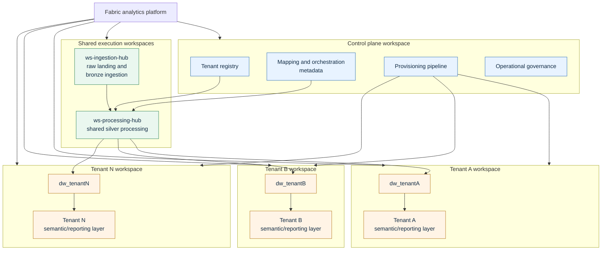
```mermaid
flowchart TB
    Platform["Fabric analytics platform"]

    subgraph Control["Control plane workspace"]
        CP1["Tenant registry"]
        CP2["Mapping and orchestration<br/>metadata"]
        CP3["Provisioning pipeline"]
        CP4["Operational governance"]
    end

    subgraph Shared["Shared execution workspaces"]
        IH["ws-ingestion-hub<br/>raw landing and<br/>bronze ingestion"]
        PH["ws-processing-hub<br/>shared silver processing"]
    end

    subgraph TenantA["Tenant A workspace"]
        AWH["dw_tenantA"]
        ASEM["Tenant A<br/>semantic/reporting layer"]
    end

    subgraph TenantB["Tenant B workspace"]
        BWH["dw_tenantB"]
        BSEM["Tenant B<br/>semantic/reporting layer"]
    end

    subgraph TenantN["Tenant N workspace"]
        NWH["dw_tenantN"]
        NSEM["Tenant N<br/>semantic/reporting layer"]
    end

    Platform --> Control
    Platform --> Shared
    Platform --> TenantA
    Platform --> TenantB
    Platform --> TenantN

    CP1 --> PH
    CP2 --> PH
    CP3 --> TenantA
    CP3 --> TenantB
    CP3 --> TenantN

    IH --> PH
    PH --> AWH
    PH --> BWH
    PH --> NWH

    AWH --> ASEM
    BWH --> BSEM
    NWH --> NSEM

    classDef control fill:#e8f3ff,stroke:#2f70b7,color:#102a43
    classDef shared fill:#eaf7ef,stroke:#2f855a,color:#102a43
    classDef tenant fill:#fff4e6,stroke:#b7791f,color:#102a43

    class CP1,CP2,CP3,CP4 control
    class IH,PH shared
    class AWH,ASEM,BWH,BSEM,NWH,NSEM tenant
```

## Design Decisions and Tradeoffs

### Shared Silver, Isolated Gold

Shared silver reduces duplication and keeps conformance logic centralized. Tenant-isolated gold keeps serving workloads, semantic models, and security boundaries cleaner. This is the main balance in the architecture.

### Why Fabric Warehouse for Gold Instead of Lakehouse

The decision to use Fabric Warehouse for Gold is not a general statement that Warehouse is always better than Lakehouse. It is a fit-for-purpose decision based on the role Gold plays in this architecture.

In this platform, Gold is the tenant-facing serving layer. Each tenant receives a stable relational contract with dimensional tables, SCD behavior, SQL endpoints, and reporting-facing schemas. That makes Fabric Warehouse a strong fit because it provides a SQL-first surface for BI consumption, stored procedures for controlled relational processing, and a natural deployment target for SQL database projects and DACPAC-based CI/CD.

The warehouse also keeps schema lifecycle separate from orchestration lifecycle. Fabric pipelines can provision workspaces, resolve runtime connections, move tenant-filtered data, and call Azure DevOps, while the warehouse schema is managed as source-controlled database code. That separation matters when the platform needs repeatable tenant onboarding and all-tenant schema rollout.

A Lakehouse is more suitable when the Gold layer is still primarily lake-native. Examples include exploratory analytics, data science and ML feature preparation, Spark-first transformations, semi-structured or unstructured data, schema-on-read workloads, open Delta table sharing, and serving patterns where the primary consumers are notebooks, Spark jobs, or Direct Lake semantic models over Delta tables. If the Gold contract does not need tenant-specific warehouse deployment, stored procedures, dimensional merge logic, or SQL database project lifecycle, a Gold Lakehouse can be the simpler and more flexible choice.

The practical guideline is:

- Use a Warehouse for Gold when the layer is a governed SQL serving contract with stable dimensional models, tenant isolation, SCD logic, and database deployment requirements.
- Use a Lakehouse for Gold when the layer is open, lake-native, Spark/ML-oriented, exploratory, or optimized around Delta tables and flexible schema evolution.

### Metadata-Driven, Not Metadata-Only

A common mistake is trying to make every transformation configurable. This architecture uses metadata where the variability is structural: tenant, table, column, connection, and SCD behavior. Complex business logic can still live in governed notebooks or warehouse code when that is clearer.

### Dynamic Connections Instead of Duplicated Pipelines

The platform passes workspace ID, lakehouse ID, warehouse ID, SQL endpoint, notebook ID, and connection ID into shared pipelines where Fabric supports runtime binding. This prevents a separate pipeline estate per tenant or per environment.

The design also handles one practical Fabric limitation: the Silver-to-Gold Copy source requires a connection ID for the Silver SQL endpoint. Instead of hardcoding that connection in the pipeline definition, the platform passes `silver_connectionid`, `silver_wh_endpoint_id`, and `silver_sqlconnectionstring` at runtime.

### Warehouse SCD Processing

SCD behavior runs in the tenant warehouse because the warehouse is the serving contract. The warehouse already owns dimensional tables, active flags, validity windows, and relational merge semantics.

### Local Mapping Tables Instead of Runtime Shortcuts

The tenant warehouse stores local copies of the mapping tables instead of resolving them through shortcuts to the core lakehouse at merge time. This keeps the SCD procedure self-contained and avoids runtime dependency on cross-workspace query behavior, shortcut resolution, and permissions to the control-plane workspace. The core lakehouse remains the source of truth; the tenant warehouse copy is the deployment-time execution contract.

### Central Logging Service

Using a lightweight HTTP logging service avoids scattering log persistence logic throughout every pipeline and notebook. It also makes telemetry consistent across provisioning and ELT workloads.

## Control Plane as the Architectural Center

The most important design choice is the control plane. In this architecture, tenant onboarding and runtime execution are driven by metadata rather than manual workspace setup.

The control plane stores metadata such as:

- Tenant identifier and tenant display name
- Capacity ID
- Fabric workspace ID
- Fabric warehouse ID
- SQL endpoint
- Connection ID
- Source-to-silver mappings
- Silver-to-gold mappings
- SCD behavior
- Active or inactive flags

The tenant metadata notebook upserts the resolved tenant runtime values into a Delta table. Conceptually, the control plane records the contract between a tenant and the platform:

```python
data = [
    Row(
        TenantId=TenantId,
        TenantName=TenantName,
        CapacityId=CapacityId,
        ConnectionId=ConnectionId,
        WorkspaceId=WorkspaceId,
        WorkspaceName="ws_" + TenantId,
        WarehouseId=WarehouseId,
        ConnectionString=ConnectionString,
        WarehouseName="dw_" + TenantId,
        CreatedBy="system",
        IsActive=True,
        DeletionFlag=False
    )
]
```

That record becomes the foundation for downstream orchestration. Pipelines do not need hardcoded tenant warehouse values when those values are discoverable through metadata.

### Core Lakehouse Metadata Contract

The control-plane core lakehouse is the metadata system of record for the platform. It contains two important schemas:

- `control`: runtime configuration, tenant registry, data quality rules, and generic dimension mapping.
- `metadata`: source-to-target table and column mapping used by orchestration and warehouse loading.

The following tables form the platform contract.

| Schema | Table | Purpose |
| --- | --- | --- |
| `control` | `config` | Environment-specific configuration values such as service principal IDs, Azure DevOps pipeline IDs, and logging endpoints |
| `control` | `tenant_info` | Tenant registry and runtime binding values for tenant workspaces and warehouses |
| `control` | `data_quality_rules` | Rule definitions for metadata-driven Silver data quality checks |
| `control` | `data_quality_results` | Execution results from Silver data quality checks by run, tenant, entity, rule, and severity |
| `control` | `dim_col_mapping` | Generic dimension column mapping and SCD behavior used by notebook-driven dimension builds |
| `metadata` | `table_mapping` | Entity-level source, Silver, Gold, staging, load strategy, and pipeline metadata |
| `metadata` | `column_mapping` | Column-level mapping, transformation, primary-key, nullability, and SCD behavior metadata |

The `control.config` table is intentionally simple:

| Column | Description |
| --- | --- |
| `config_key` | Configuration name, such as `LOG_FUNCTION_URL`, `SP_ClientID`, or `devops_provisioning_pipeline_id` |
| `config_value` | Environment-specific value |
| `Environment` | Environment scope such as `DEV`, `TEST`, or `PROD` |

This table keeps runtime configuration outside notebooks and pipelines. For example, the final Bronze-to-Silver notebook resolves `LOG_FUNCTION_URL` from `control.config`, while the tenant provisioning pipeline resolves the service principal and Azure DevOps pipeline ID from the same contract.

The tenant registry is held in `control.tenant_info`:

| Column Group | Columns |
| --- | --- |
| Tenant identity | `TenantId`, `TenantName` |
| Capacity and connection | `CapacityId`, `ConnectionId`, `ConnectionString` |
| Fabric workspace binding | `WorkspaceId`, `WorkspaceName` |
| Fabric warehouse binding | `WarehouseId`, `WarehouseName` |
| Audit and lifecycle | `DateCreated`, `CreatedBy`, `IsActive`, `LastUpdate`, `DeletionFlag` |

This table is the runtime bridge between the shared processing pipeline and tenant-specific serving warehouses. The processing pipeline filters this table by `TenantId`, then uses `WorkspaceId`, `WarehouseId`, `ConnectionString`, and `ConnectionId` to bind the warehouse connection dynamically.

The Silver DQ framework is configured through `control.data_quality_rules`:

| Column | Description |
| --- | --- |
| `entity_name` | Silver entity/table to validate |
| `rule_type` | Rule type, such as `NOT_NULL`, `UNIQUE`, or `ALLOWED_VALUES` |
| `column_name` | Column evaluated by the rule |
| `rule_value` | Optional rule parameter, such as a comma-separated allowed-value list |
| `severity` | Business severity of the rule |
| `is_active` | Flag controlling whether the rule participates in the current run |

DQ execution results are appended to `control.data_quality_results`:

| Column | Description |
| --- | --- |
| `runId` | Fabric pipeline or notebook run identifier |
| `tenantId` | Tenant evaluated by the DQ check |
| `entity_name` | Entity or Silver table evaluated |
| `rule_type` | Rule type that was executed |
| `column_name` | Column evaluated by the rule, when applicable |
| `failed_count` | Number of records that failed the rule |
| `status` | Rule execution result, such as passed or failed |
| `severity` | Severity copied from the rule definition |
| `event_time` | Timestamp when the result was recorded |

The generic dimension mapping table, `control.dim_col_mapping`, supports notebook-driven dimension builds:

| Column Group | Columns |
| --- | --- |
| Dimension identity | `dim_name` |
| Column mapping | `source_column`, `target_column`, `transform_expr` |
| Key and SCD behavior | `is_business_key`, `is_scd_type1`, `is_scd_type2`, `track_changes` |
| Lifecycle | `is_active`, `created_at` |

The entity-level orchestration contract is `metadata.table_mapping`:

| Column Group | Columns |
| --- | --- |
| Identity and orchestration | `table_map_id`, `pipeline_id`, `tenant_id` |
| Source and target tables | `source_table`, `silver_table`, `gold_table`, `staging_gold_table` |
| Load behavior | `primary_table`, `load_strategy`, `watermark_column` |
| Lifecycle | `created_at`, `is_active` |

This table drives the final processing pipeline. Bronze-to-Silver uses `source_table` and `silver_table`; Silver-to-Gold uses `silver_table`, `staging_gold_table`, and `gold_table`.

The column-level mapping contract is `metadata.column_mapping`:

| Column Group | Columns |
| --- | --- |
| Identity | `column_map_id`, `table_map_id` |
| Source and target mapping | `source_table`, `source_column`, `target_column`, `target_table`, `transformation_logic` |
| SCD behavior | `is_scd_type1`, `is_scd_type2`, `track_changes`, `is_primary_key` |
| Validation and lifecycle | `is_nullable`, `is_active` |

This metadata is copied or mirrored into the tenant warehouse reporting schema as part of schema deployment and tenant setup, where `reporting.column_mapping` is used directly by the warehouse SCD stored procedure.

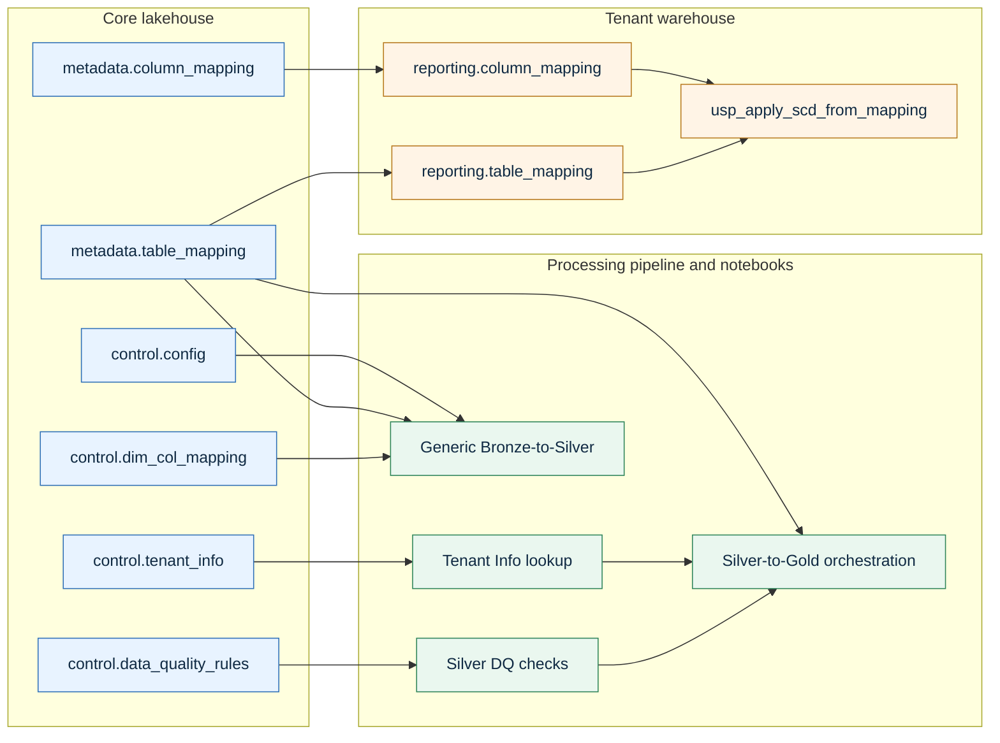
```mermaid
flowchart LR
    subgraph Core["Core lakehouse"]
        Config["control.config"]
        TenantInfo["control.tenant_info"]
        DQRules["control.data_quality_rules"]
        DimMap["control.dim_col_mapping"]
        TableMap["metadata.table_mapping"]
        ColumnMap["metadata.column_mapping"]
    end

    subgraph Processing["Processing pipeline and notebooks"]
        TenantLookup["Tenant Info lookup"]
        BronzeSilver["Generic Bronze-to-Silver"]
        DQ["Silver DQ checks"]
        SilverGold["Silver-to-Gold orchestration"]
    end

    subgraph Warehouse["Tenant warehouse"]
        ReportingTableMap["reporting.table_mapping"]
        ReportingColumnMap["reporting.column_mapping"]
        SCD["usp_apply_scd_from_mapping"]
    end

    Config --> BronzeSilver
    TenantInfo --> TenantLookup
    TableMap --> BronzeSilver
    TableMap --> SilverGold
    DQRules --> DQ
    DimMap --> BronzeSilver

    ColumnMap --> ReportingColumnMap
    TableMap --> ReportingTableMap
    ReportingColumnMap --> SCD
    ReportingTableMap --> SCD
    TenantLookup --> SilverGold
    DQ --> SilverGold

    classDef core fill:#e8f3ff,stroke:#2f70b7,color:#102a43
    classDef processing fill:#eaf7ef,stroke:#2f855a,color:#102a43
    classDef tenant fill:#fff4e6,stroke:#b7791f,color:#102a43

    class Config,TenantInfo,DQRules,DimMap,TableMap,ColumnMap core
    class TenantLookup,BronzeSilver,DQ,SilverGold processing
    class ReportingTableMap,ReportingColumnMap,SCD tenant
```

## Automation Identity and Permission Model

The platform uses a Microsoft Entra service principal as the automation identity for cross-service orchestration. This identity has two jobs:

- Azure DevOps uses it to call Fabric APIs for environment promotion and deployment pipeline automation.
- Fabric pipelines use it through pre-built Web connections to call Azure DevOps pipeline APIs and Fabric REST APIs.

The service principal is not a human operator account. It is an automation identity with scoped permissions in Entra, Fabric, and Azure DevOps.

### Create the Service Principal in Microsoft Entra

The identity starts as an app registration in Microsoft Entra ID. For service-to-service automation, the redirect URI is not required. A certificate is preferred for long-running production automation but a client secret is acceptable for development or controlled internal environments if rotation is managed. For this project I will use a client secret.

The values captured from Entra become part of the platform configuration.

| Value | Usage |
| --- | --- |
| Tenant ID | Token authority for Fabric and Azure DevOps calls |
| Application client ID | Service principal identifier used by connections and pipeline config |
| Enterprise application object ID | Identity used when adding the principal to Azure DevOps |
| Client secret or certificate | Credential used by Fabric Web connections or Azure DevOps tasks |

#### Client Secret

To obtain a secret, go to the app registration in Microsoft Entra ID, then open **Certificates and secrets** and create a new client secret.

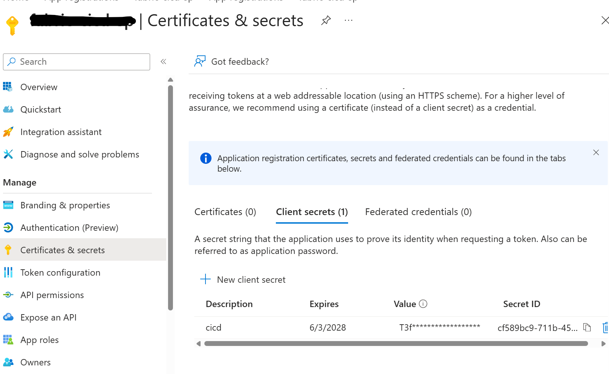

Capture the **Value** immediately after creating the secret. Microsoft Entra only shows the secret value once. The **Secret ID** is useful for inventory and rotation tracking, but it is not the password used by Azure DevOps or Fabric connections.

In this pattern, the secret value is used in two places.

- Azure DevOps variable groups or secret variables, where the pipeline exchanges the client ID and secret for a Fabric access token.
- Fabric Web/Web V2 connections, where Fabric pipelines authenticate to Azure DevOps or Fabric REST APIs as the service principal.

For production, prefer certificate-based authentication or store the secret in a governed secret store such as Azure Key Vault. If a client secret is used, set an explicit rotation policy and update every dependent Azure DevOps variable group and Fabric connection before the old secret expires.

#### API Permissions and Admin Consent

##### API Permissions

Add only the application permissions needed for the automation that this service principal owns.

**Minimum for Fabric CI/CD:**

- `Tenant.Read.All`
- `Workspace.ReadWrite.All`
- `Capacity.Read.All`, only if the automation resolves or validates Fabric capacities

If available in your tenant:

- `Fabric.ReadWrite.All`, for Fabric REST API operations exposed through the newer Fabric permission model

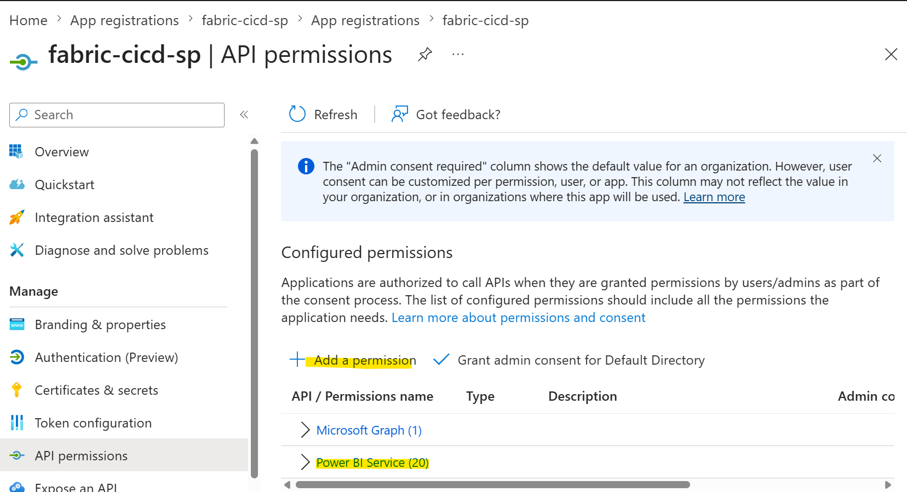

These API permissions allow the service principal to request tokens and call the relevant APIs, but they do not replace Fabric object permissions. The same identity still needs explicit access to deployment pipelines, workspaces, connections, lakehouses, warehouses, and any other Fabric items it operates on.

##### Admin Consent

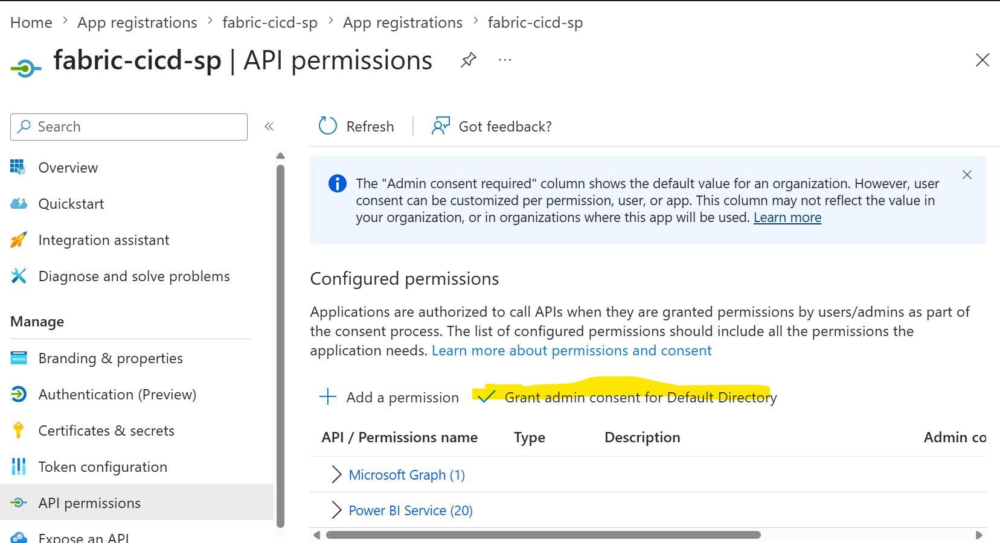

Granting admin consent makes the configured application permissions effective for the tenant. Without consent, the token request or the downstream API call can fail with `Unauthorized`, `Forbidden`, or consent-related errors even when the app registration appears to have the right permissions.

Verify the Enterprise Application by checking the app under **Entra ID > Enterprise Applications**:

- **Permissions**: consent status is granted for the required permissions.
- **Properties**: **Enabled for users to sign in?** is set to **Yes**.

Also confirm that you are using the correct identity values. Azure DevOps service connections and token requests usually need the application client ID, while Azure DevOps organization or project membership may require the Enterprise Application object ID. Confusing the app registration object ID, application client ID, and enterprise application object ID is a common source of failed automation setup.

Azure DevOps treats service principals through its own permission model, so the service principal must be explicitly added to the Azure DevOps organization or project. Adding the app to an Entra security group is not enough by itself. In Azure DevOps, grant the identity access only to the project and pipeline it needs to run.

### Permissions for Azure DevOps to Invoke Fabric Deployment Pipelines

When Azure DevOps promotes Fabric artifacts across environments, the service principal needs permissions in Fabric, not just in Azure DevOps.

The required Fabric-side setup is:

1. Enable the Fabric tenant setting that allows service principals to call Fabric APIs.

   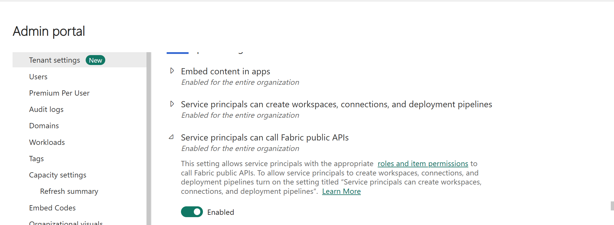

2. Enable the tenant setting for service principals to create workspaces, connections, and deployment pipelines when the automation identity owns those setup actions.

   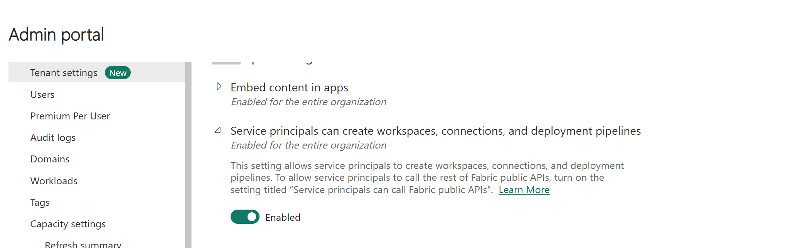

3. Add the service principal to the Fabric deployment pipeline as a pipeline admin.

   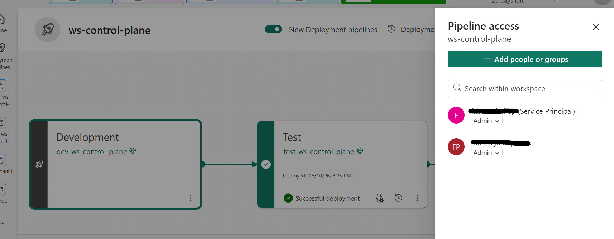

4. Add the service principal to the source and target workspaces with at least Contributor permission for deployment operations.

   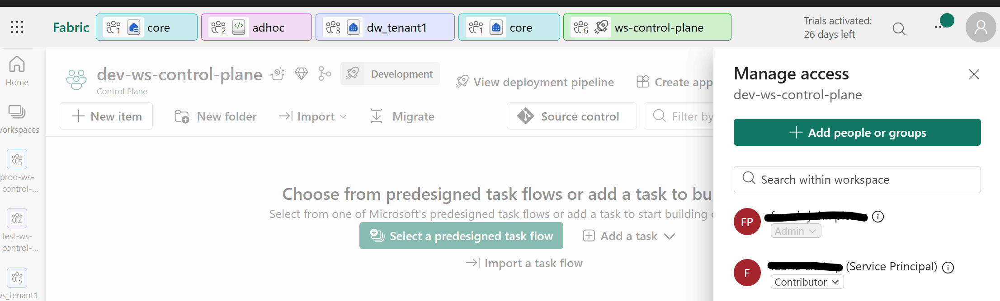

5. Grant higher workspace permissions only where the automation needs to assign stages, manage workspace-level settings, or administer deployment pipeline structure.


This matters because Fabric deployment pipeline permissions and workspace permissions are separate. A principal can be a deployment pipeline admin and still fail deployment if it does not also have the required workspace role.

Operationally, this means the service principal must be added directly to the Fabric Deployment Pipeline through **Manage access** and granted sufficient deployment pipeline permission before Azure DevOps can invoke the deployment API. Adding the service principal only to the source and target workspaces is not enough.

The service principal must also have access to every Fabric connection referenced by the deployed artifacts. At minimum, grant the service principal **User** access to the Web/Web V2, Lakehouse, SQL endpoint, Data Warehouse, and logging connections used by the Fabric pipelines. If even one referenced connection is missed, automated deployment can fail with an error similar to: `User does not have access to the connection used in the Pipeline`. Manual deployment may still succeed because it runs under the interactive user's connection permissions.

The Azure DevOps pipeline then acquires a Microsoft Entra token for Fabric and calls the Fabric deployment pipeline APIs. Conceptually, that flow looks like this:

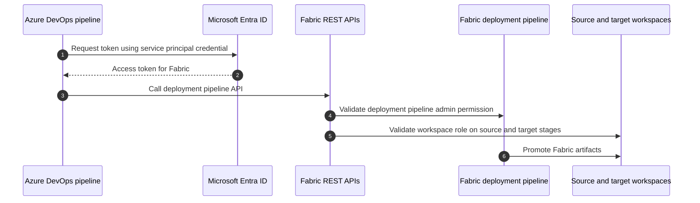
```mermaid
sequenceDiagram
    autonumber
    participant DevOps as Azure DevOps pipeline
    participant Entra as Microsoft Entra ID
    participant Fabric as Fabric REST APIs
    participant DP as Fabric deployment pipeline
    participant WS as Source and target workspaces

    DevOps->>Entra: Request token using service principal credential
    Entra-->>DevOps: Access token for Fabric
    DevOps->>Fabric: Call deployment pipeline API
    Fabric->>DP: Validate deployment pipeline admin permission
    Fabric->>WS: Validate workspace role on source and target stages
    DP->>WS: Promote Fabric artifacts
```

### Get an Azure DevOps PAT for Fabric Connections

The Fabric tenant provisioning pipeline invokes Azure DevOps through a pre-built Web/Web V2 connection. In this implementation, that connection can use an Azure DevOps Personal Access Token (PAT) to call the Azure DevOps REST API and queue the database deployment pipeline.

Create the PAT from Azure DevOps under **User settings > Personal access tokens**. Use a dedicated automation account where possible instead of a personal human account, because the PAT inherits the permissions and lifecycle of the identity that created it.

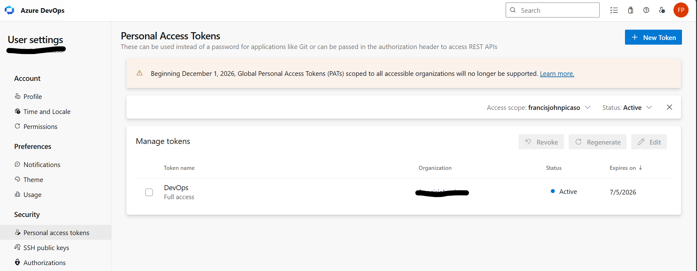

When creating the PAT:

1. Set the organization to the Azure DevOps organization that owns the deployment pipeline.

2. Set a short, managed expiration period and record the rotation date.

3. Grant only the scopes required to queue the pipeline. For this pattern, start with **Build: Read & execute** for YAML pipeline run operations. Add broader scopes only if the Fabric connection calls additional Azure DevOps APIs.

4. Copy the PAT value immediately after creation. Azure DevOps only shows the token once.


Store the PAT as the secret in the Fabric Web/Web V2 connection used for Azure DevOps API calls. For a Basic authentication style connection, the username can be a placeholder value and the PAT is used as the password. The connection base URL should point to the Azure DevOps organization, for example:

```text
https://dev.azure.com/{organization}/{project}
```

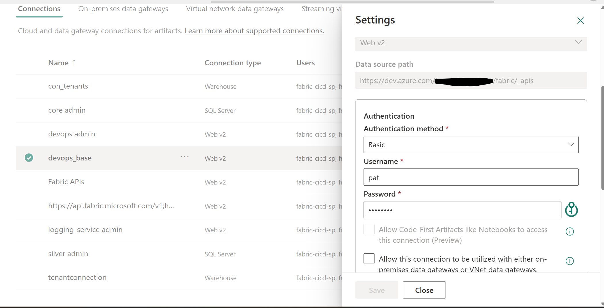

The PAT does not remove the need for Azure DevOps permissions. The PAT-owning identity must still have access to the organization, project, pipeline, and any pipeline resources required at runtime. Treat the PAT like a production secret: restrict its scope, rotate it, and update the Fabric connection before it expires.

### Permissions for Fabric to Invoke Azure DevOps Pipelines

The reverse direction is also required. The Fabric tenant provisioning pipeline triggers an Azure DevOps pipeline after creating or resolving the tenant workspace and warehouse.

For this direction, the Azure DevOps identity used by the Fabric connection needs:

- Access to the Azure DevOps organization.

  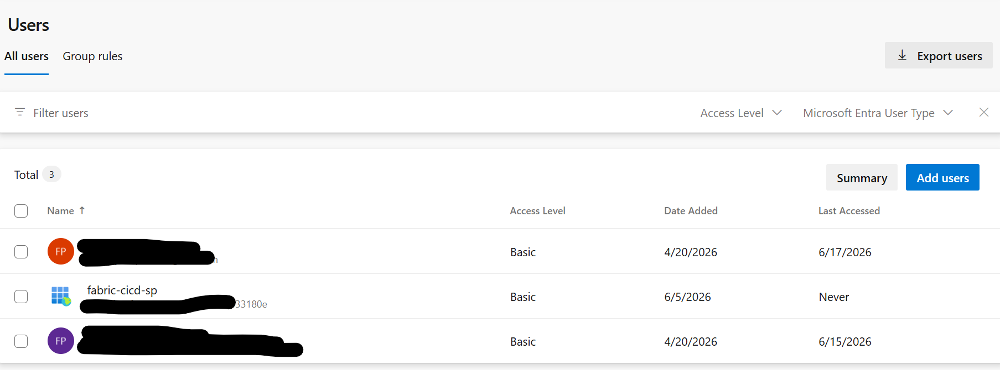

- Access to the Azure DevOps project that owns the provisioning pipeline.

- Permission to view and run the specific pipeline.

- Permission to read any variable groups, service connections, secure files, or repositories used by that pipeline.

  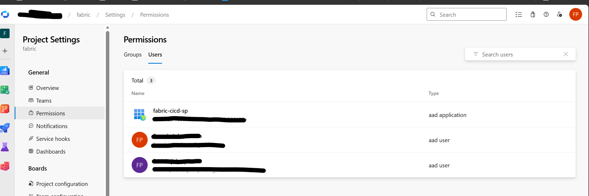


  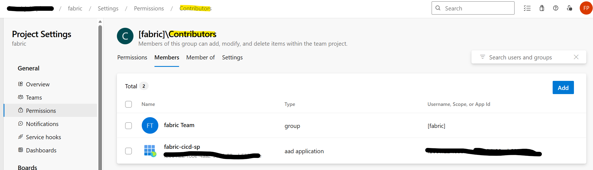
  
The Fabric pipeline uses a pre-built Web connection for Azure DevOps. In this implementation, the connection can be backed by the Azure DevOps PAT described above and calls the Azure DevOps Run Pipeline API with tenant-specific parameters.

```json
{
  "relativeUrl": "pipelines/@{variables('devops_provisioning_pipeline_id')}/runs?api-version=7.1",
  "body": {
    "value": "{\"templateParameters\":{\"tenantId\":\"@{pipeline().parameters.tenantid}\",\"sqlServer\":\"@{activity('Get Connection String').output.connectionString}\"}}",
    "type": "Expression"
  }
}
```

The important design principle is that neither platform is trusted implicitly. Fabric must grant the service principal workspace and deployment permissions. Azure DevOps must grant the PAT-owning identity organization, project, and pipeline permissions.

## Pre-Built Platform Connections

The architecture uses pre-built Fabric connections so pipelines can reference governed connection objects instead of carrying raw URLs, credentials, or secrets inside every activity.

These connections are created once per environment and then referenced by pipeline activities. If connection creation is automated with the service principal, the Fabric tenant setting that allows service principals to create connections must be enabled before the bootstrap run.

For automated deployment, the service principal used by Azure DevOps must be granted access to each of these connections, with **User** as the minimum practical permission. This applies to both source-environment connections and any target-environment connections selected through Fabric deployment rules.

The connection foundation includes:

| Connection | Type | Used by | Purpose | Sample config |
| --- | --- | --- | --- | --- |
| Fabric REST API connection | Web / Web V2 | Tenant provisioning pipeline | List workspaces, create workspaces, list warehouses, create warehouses, assign workspace roles, get warehouse connection string | 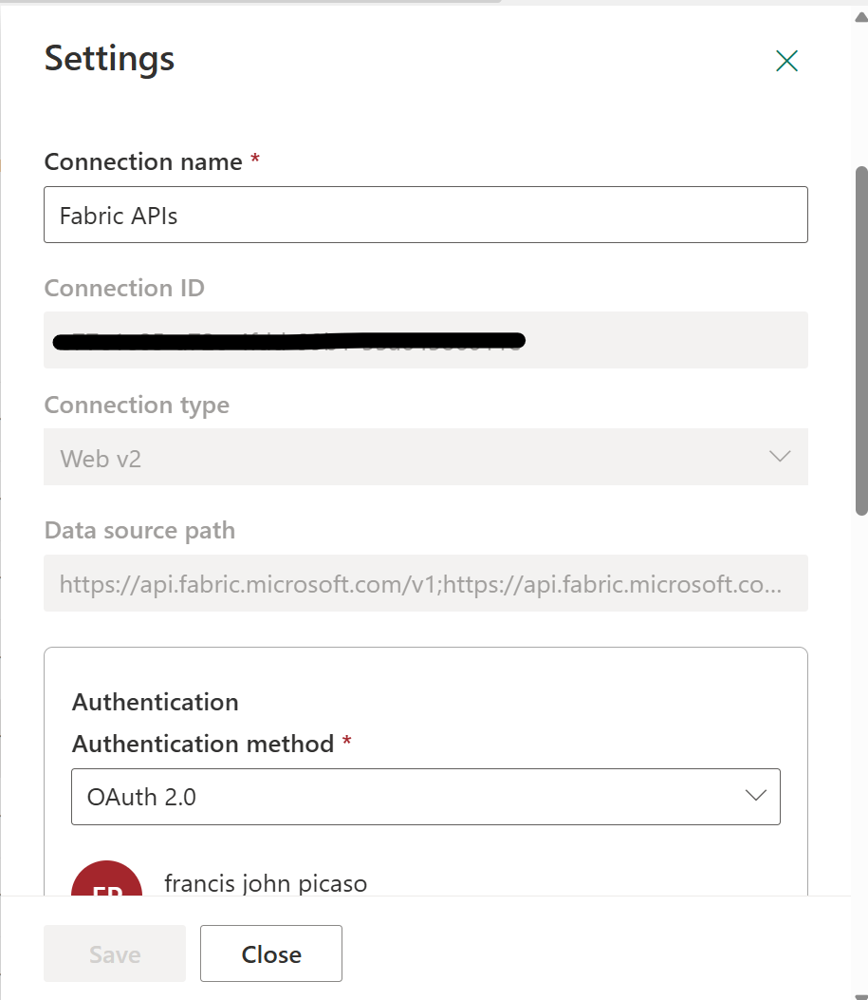 |
| Azure DevOps REST API connection | Web / Web V2 | Tenant provisioning pipeline | Trigger the Azure DevOps database provisioning pipeline | 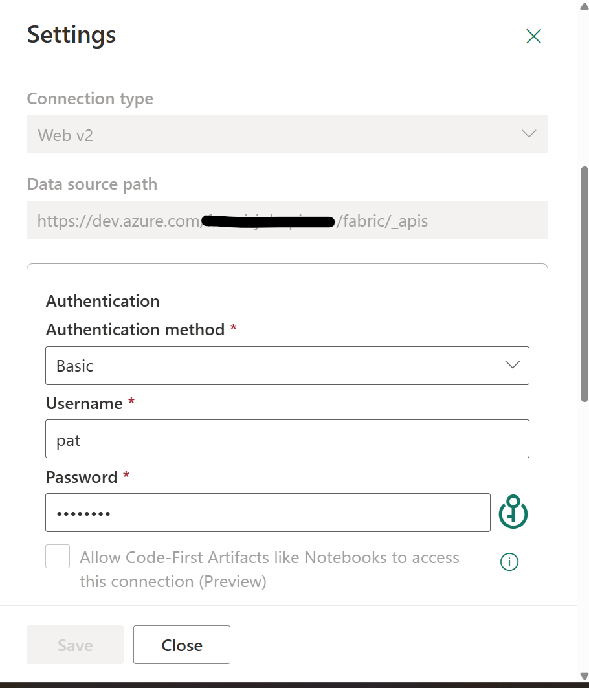 |
| Logging service connection | Web / Web V2 | Provisioning and ELT pipelines | Emit structured operational events | 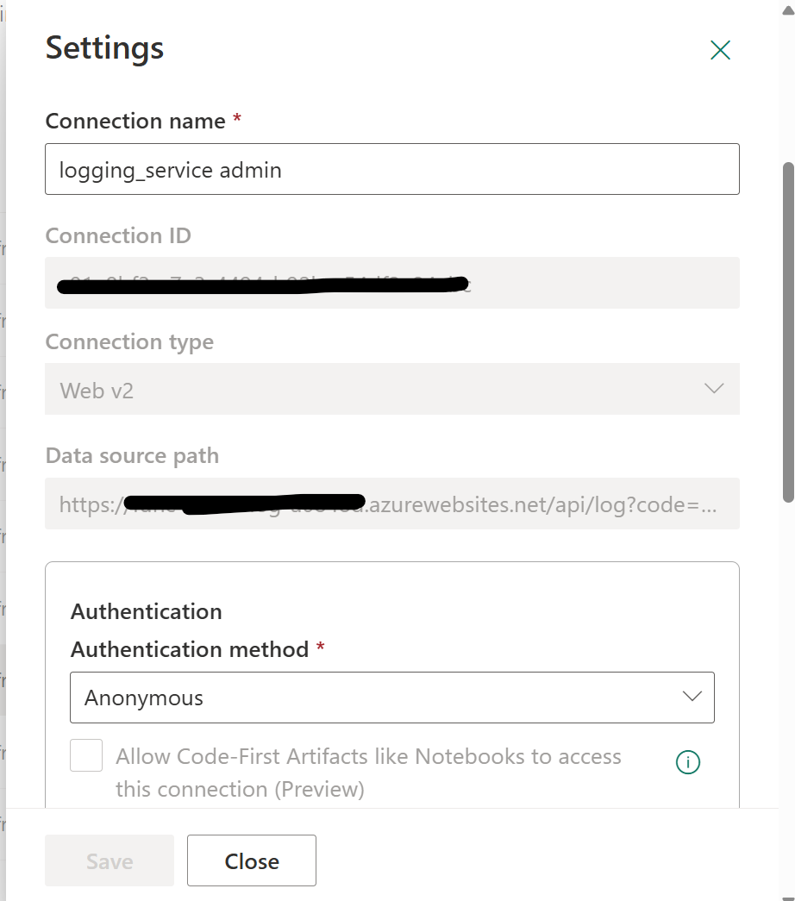 |
| `core admin` SQL connection (one for each environment) | SQL endpoint connection parameters | Tenant provisioning pipeline | Runtime parameters used to read environment configuration from the core lakehouse, including `SP_ClientID` and `devops_provisioning_pipeline_id` | 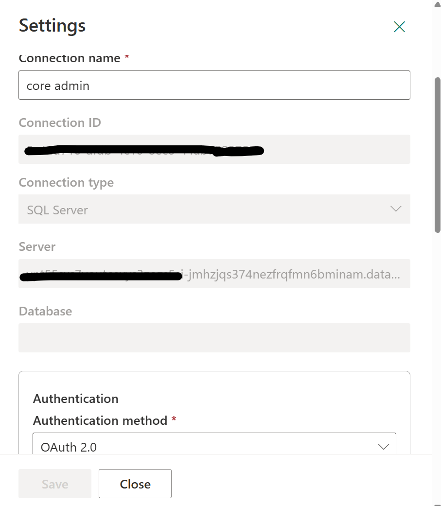 |
| `silver admin` SQL connection (one for each environment) | SQL endpoint connection | Silver-to-gold Copy activity source | Read shared Silver tables through the environment's Silver lakehouse SQL endpoint | 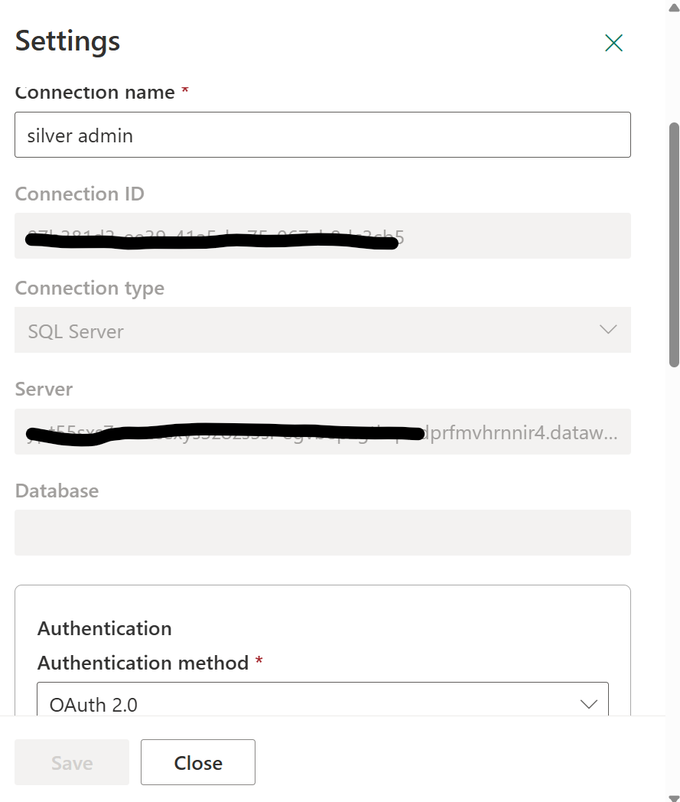 |
| Tenant warehouse connection | Data Warehouse connection | Silver-to-gold pipeline | Load staging tables and execute warehouse stored procedures | 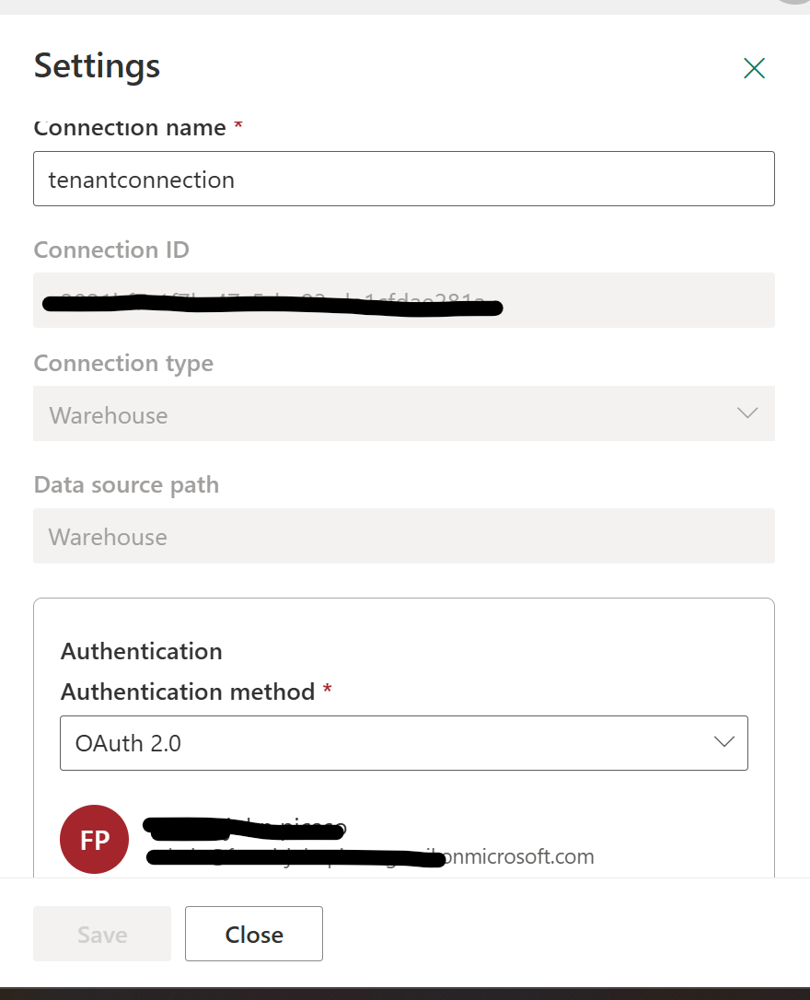 |

This keeps orchestration code portable. A pipeline activity can reference a connection object and parameterize only the parts that should change at runtime, such as workspace ID, warehouse ID, SQL endpoint, tenant ID, or Azure DevOps pipeline ID.

For Web connections, the base URLs are stable platform endpoints:

```text
https://api.fabric.microsoft.com/v1/
https://dev.azure.com/{organization}/{project}
https://{logging-function-host}/api/
```

Tenant provisioning needs a `core admin` connection context for each environment, but the final implementation does not bind that connection directly in the activity. It accepts the core connection details as runtime parameters: `core_connectionid`, `core_workspaceid`, `core_warehouseid`, and `core_sqlconnstring`. The pipeline uses those parameters to query `control.config` for environment-scoped values such as the service principal `client ID` and Azure DevOps provisioning `pipeline ID`. This keeps the core configuration lookup dynamic while still supporting the single aggregate query that returns both values in one Lookup activity.

This can look redundant because the Fabric connection object may already have been created against a SQL endpoint in the UI. In the pipeline activity schema, however, the connection reference and the target binding are separate. The `core_connectionid` tells Fabric which saved credential or authorization context to use, while `core_workspaceid`, `core_warehouseid`, and `core_sqlconnstring` tell the activity which Fabric item and SQL endpoint to target at runtime.

The Silver lakehouse SQL connection is pre-created as a governed Fabric connection, but the final processing pipeline does not hardcode it in the Copy activity. The Copy activity that moves Silver data into Gold staging requires a `connection ID` for the source SQL endpoint, not only the Silver lakehouse `workspace ID` and SQL endpoint item ID. The pipeline handles this by accepting the Silver source connection values as runtime parameters:

- `silver_connectionid`
- `silver_wh_endpoint_id`
- `silver_sqlconnectionstring`

This means DEV, TEST, and PROD can each pass the correct Silver source connection ID, SQL endpoint item ID, and SQL endpoint string when the pipeline runs. The connection still exists per environment if each environment has its own Silver SQL endpoint, but the pipeline definition stays dynamic.

The tenant warehouse target also binds dynamically from `control.tenant_info`, including `WorkspaceId`, `WarehouseId`, `ConnectionString`, and `ConnectionId`.

For the Gold sink, the Warehouse connection should be understood as the saved credential or authorization context, not as the warehouse locator. The activity still receives the actual target warehouse through `WorkspaceId`, `WarehouseId`, and `ConnectionString`. Because of that, the same Warehouse connection can be reused across DEV, TEST, and PROD if the same identity is allowed to access the target warehouses in those environments. Create separate Warehouse connections only when the credential boundary changes, such as separate service principals, separate user accounts, different tenants, different security policies, or different connection ownership per environment.

## Automated Tenant Provisioning

Tenant provisioning is implemented as a Fabric pipeline that calls Fabric REST APIs through Web Activities and delegates warehouse database deployment to Azure DevOps. The final pipeline keeps Fabric responsible for workspace and warehouse lifecycle, while the database project remains responsible for schema, tables, mapping objects, and stored procedures.

The pipeline follows an idempotent pattern:

1. Read environment-specific configuration from `control.config`.
2. Set the service principal client ID and Azure DevOps provisioning pipeline ID.
3. List existing Fabric workspaces.
4. Filter by expected tenant workspace name.
5. Create the workspace only if it does not exist.
6. Add the service principal as a Contributor when a workspace is newly created.
7. List warehouses in the tenant workspace.
8. Create the warehouse only if it does not exist.
9. Retrieve the warehouse SQL connection string.
10. Trigger the Azure DevOps provisioning pipeline with `tenantId` and `sqlServer`.
11. Store the Azure DevOps run ID and initial run state.
12. Poll Azure DevOps until the database deployment run is completed.
13. Register the tenant in `control.tenant_info` only when database deployment succeeds.
14. Emit success or failure telemetry.

This turns onboarding into a repeatable platform workflow instead of a manual administration task.

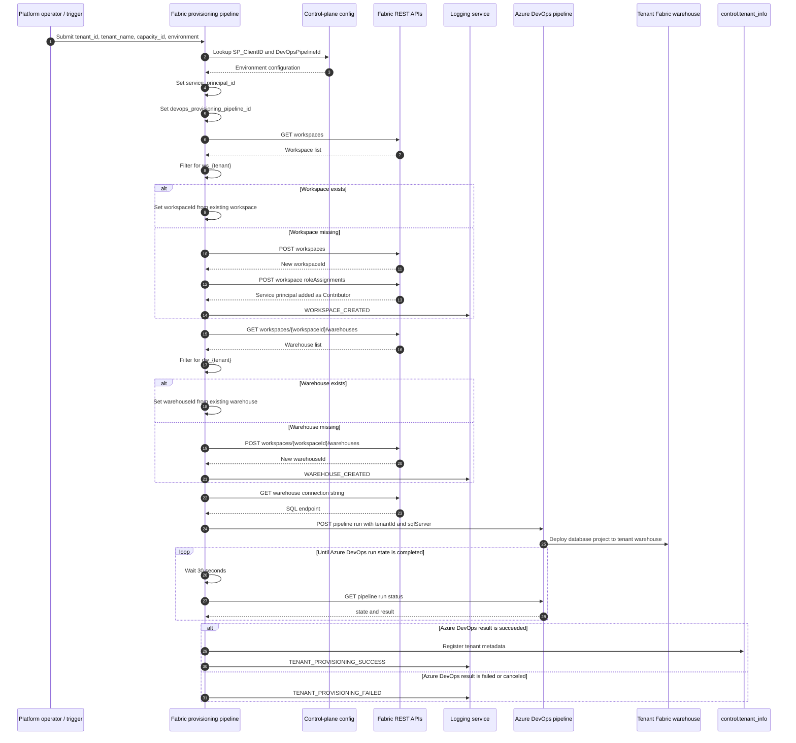
```mermaid
sequenceDiagram
    autonumber
    participant Operator as Platform operator / trigger
    participant Pipe as Fabric provisioning pipeline
    participant Config as Control-plane config
    participant Fabric as Fabric REST APIs
    participant Log as Logging service
    participant DevOps as Azure DevOps pipeline
    participant DW as Tenant Fabric warehouse
    participant Registry as control.tenant_info

    Operator->>Pipe: Submit tenant_id, tenant_name, capacity_id, environment
    Pipe->>Config: Lookup SP_ClientID and DevOpsPipelineId
    Config-->>Pipe: Environment configuration
    Pipe->>Pipe: Set service_principal_id
    Pipe->>Pipe: Set devops_provisioning_pipeline_id

    Pipe->>Fabric: GET workspaces
    Fabric-->>Pipe: Workspace list
    Pipe->>Pipe: Filter for ws_{tenant}

    alt Workspace exists
        Pipe->>Pipe: Set workspaceId from existing workspace
    else Workspace missing
        Pipe->>Fabric: POST workspaces
        Fabric-->>Pipe: New workspaceId
        Pipe->>Fabric: POST workspace roleAssignments
        Fabric-->>Pipe: Service principal added as Contributor
        Pipe->>Log: WORKSPACE_CREATED
    end

    Pipe->>Fabric: GET workspaces/{workspaceId}/warehouses
    Fabric-->>Pipe: Warehouse list
    Pipe->>Pipe: Filter for dw_{tenant}

    alt Warehouse exists
        Pipe->>Pipe: Set warehouseId from existing warehouse
    else Warehouse missing
        Pipe->>Fabric: POST workspaces/{workspaceId}/warehouses
        Fabric-->>Pipe: New warehouseId
        Pipe->>Log: WAREHOUSE_CREATED
    end

    Pipe->>Fabric: GET warehouse connection string
    Fabric-->>Pipe: SQL endpoint
    Pipe->>DevOps: POST pipeline run with tenantId and sqlServer
    DevOps->>DW: Deploy database project to tenant warehouse

    loop Until Azure DevOps run state is completed
        Pipe->>Pipe: Wait 30 seconds
        Pipe->>DevOps: GET pipeline run status
        DevOps-->>Pipe: state and result
    end

    alt Azure DevOps result is succeeded
        Pipe->>Registry: Register tenant metadata
        Pipe->>Log: TENANT_PROVISIONING_SUCCESS
    else Azure DevOps result is failed or canceled
        Pipe->>Log: TENANT_PROVISIONING_FAILED
    end
```

### Dynamic Fabric Web Activity Pattern

The provisioning pipeline builds Fabric API calls dynamically from tenant parameters and resolved variables.

Before it provisions tenant infrastructure, it reads environment-specific operational settings from the control-plane configuration table:

```sql
SELECT
    MAX(CASE WHEN config_key = 'SP_ClientID'
        THEN config_value END) AS SP_ClientID,
    MAX(CASE WHEN config_key = 'devops_provisioning_pipeline_id'
        THEN config_value END) AS DevOpsPipelineId
FROM control.config
WHERE Environment = '@{pipeline().parameters.Environment}'
```

The connection settings for this lookup are also parameterized:

```json
{
  "type": "DataWarehouseTable",
  "connectionSettings": {
    "properties": {
      "type": "DataWarehouse",
      "typeProperties": {
        "artifactId": "@pipeline().parameters.core_warehouseid",
        "endpoint": "@pipeline().parameters.core_sqlconnstring",
        "workspaceId": "@pipeline().parameters.core_workspaceid"
      },
      "externalReferences": {
        "connection": "@pipeline().parameters.core_connectionid"
      }
    }
  }
}
```

The connection object may already be associated with a SQL endpoint, but the activity still carries the target fields separately. In this pattern, the connection ID is treated as the credential context, while the workspace ID, warehouse ID, and SQL connection string are treated as the runtime target. This is slightly redundant from a human perspective, but it matches how Fabric represents dynamically bound SQL endpoint and warehouse activities.

This lookup is supported by parameterized core admin connection values for the current environment. At this point in the run, the tenant workspace and warehouse may not exist yet, so the provisioning pipeline needs a stable way to read bootstrap configuration from the core lakehouse. The aggregate query returns both `SP_ClientID` and `DevOpsPipelineId` in one row, which lets the pipeline set both variables from a single Lookup instead of running two separate lookups against `control.config`. The returned values are stored in pipeline variables and reused later for workspace permission assignment and Azure DevOps deployment triggering.

This implementation is not mandatory. Teams can modify the bootstrap approach as they see fit. One can use a different connection naming convention, resolve configuration from Azure DevOps variable groups, use Key Vault-backed settings, or automate connection creation if that better fits their governance and deployment model. The architecture pattern requires an environment-aware source of bootstrap configuration; parameterized core admin connection values are one practical implementation.

```json
{
  "name": "Create Warehouse",
  "type": "WebActivity",
  "typeProperties": {
    "method": "POST",
    "relativeUrl": {
      "value": "@concat('workspaces/', variables('workspaceId'), '/warehouses')",
      "type": "Expression"
    },
    "headers": {
      "content-type": "application/json"
    },
    "body": {
      "value": "@concat('{', '\"displayName\":\"dw_', pipeline().parameters.tenantid, '\"', '}')",
      "type": "Expression"
    }
  }
}
```

When a workspace is newly created, the pipeline grants the configured service principal Contributor access to that workspace:

```json
{
  "name": "Add WS permission to Service Principal",
  "type": "WebActivity",
  "typeProperties": {
    "method": "POST",
    "relativeUrl": {
      "value": "workspaces/@{variables('workspaceId')}/roleAssignments",
      "type": "Expression"
    },
    "headers": {
      "content-type": "application/json"
    },
    "body": {
      "principal": {
        "id": "@{variables('service_principal_id')}",
        "type": "ServicePrincipal"
      },
      "role": "Contributor"
    }
  }
}
```

The same approach is used to retrieve the runtime SQL endpoint after the warehouse exists:

```json
{
  "name": "Get Connection String",
  "type": "WebActivity",
  "typeProperties": {
    "method": "GET",
    "relativeUrl": {
      "value": "workspaces/@{variables('workspaceId')}/warehouses/@{variables('warehouseId')}/connectionString",
      "type": "Expression"
    }
  }
}
```

Finally, the pipeline delegates tenant warehouse database deployment to Azure DevOps:

```json
{
  "name": "Deploy DB to Tenant WH",
  "type": "WebActivity",
  "typeProperties": {
    "method": "POST",
    "relativeUrl": "pipelines/@{variables('devops_provisioning_pipeline_id')}/runs?api-version=7.1",
    "body": {
      "value": "{\"templateParameters\":{\"tenantId\":\"@{pipeline().parameters.tenantid}\",\"sqlServer\":\"@{activity('Get Connection String').output.connectionString}\"}}",
      "type": "Expression"
    }
  }
}
```

The final implementation does not register the tenant immediately after triggering Azure DevOps. It captures the Azure DevOps run ID and waits until the database deployment run completes.

```json
{
  "name": "Set devops_run_id",
  "type": "SetVariable",
  "typeProperties": {
    "variableName": "devops_run_id",
    "value": {
      "value": "@string(activity('Deploy DB to Tenant WH').output.id)",
      "type": "Expression"
    }
  }
}
```

The Until activity polls Azure DevOps until the run state is `completed`:

```json
{
  "name": "Wait for DB Deployment",
  "type": "Until",
  "typeProperties": {
    "expression": {
      "value": "@equals(variables('devops_state'), 'completed')",
      "type": "Expression"
    },
    "timeout": "0.12:00:00"
  }
}
```

Inside the loop, the pipeline waits 30 seconds and then calls the Azure DevOps run status endpoint:

```json
{
  "name": "Check Run Status",
  "type": "WebActivity",
  "typeProperties": {
    "method": "GET",
    "relativeUrl": {
      "value": "pipelines/@{variables('devops_provisioning_pipeline_id')}/runs/@{variables('devops_run_id')}?api-version=7.1",
      "type": "Expression"
    }
  }
}
```

The result variable is set only when the Azure DevOps run is completed. This avoids a common issue where the `result` property does not exist while the run is still `inProgress`:

```json
{
  "name": "Set devops_result loop",
  "type": "SetVariable",
  "typeProperties": {
    "variableName": "devops_result",
    "value": {
      "value": "@if(equals(activity('Check Run Status').output.state, 'completed'), activity('Check Run Status').output.result, '')",
      "type": "Expression"
    }
  }
}
```

After the Until loop completes, tenant registration becomes the final commit step:

```json
{
  "name": "Successful Deployment",
  "type": "IfCondition",
  "typeProperties": {
    "expression": {
      "value": "@equals(variables('devops_result'),'succeeded')",
      "type": "Expression"
    }
  }
}
```

On success, the pipeline runs the tenant metadata notebook and registers the tenant in `control.tenant_info`. On failure, it logs `TENANT_PROVISIONING_FAILED` and does not mark the tenant active. This prevents partially provisioned tenants from entering the active tenant registry.

In this pattern, the pipeline does not assume infrastructure and does not own warehouse schema deployment. It discovers or creates Fabric infrastructure, captures the resulting identifiers, grants the required deployment principal access, retrieves the SQL endpoint, delegates schema deployment to Azure DevOps, waits for completion, and registers the tenant only after the database deployment succeeds.

## Silver Lakehouse Shortcuts

The Silver lakehouse acts as the shared processing surface, but it does not physically copy every upstream control or bronze asset into the processing workspace. Instead, it uses OneLake shortcuts to expose required upstream data through a local namespace.

In this implementation, the Silver lakehouse includes shortcuts such as:

| Shortcut | Location in Silver | Target |
| --- | --- | --- |
| `bronze_raw` | `Files/bronze_raw` | Bronze files in the ingestion lakehouse |
| `control` | `Tables/control` | Control tables in the core lakehouse |
| `metadata` | `Tables/metadata` | Metadata tables in the core lakehouse |
| Source-specific file shortcuts, such as `sales` | `Files/sales` | Source-domain landing folders |

This allows processing notebooks to use stable local paths while the physical ownership remains with the ingestion and control-plane workspaces.

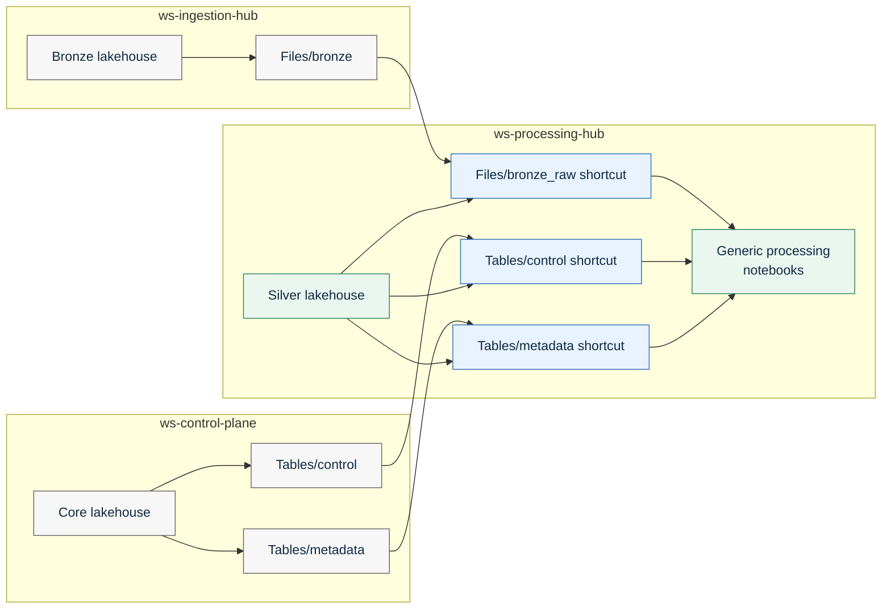
```mermaid
flowchart LR
    subgraph Ingestion["ws-ingestion-hub"]
        BronzeLH["Bronze lakehouse"]
        BronzeFiles["Files/bronze"]
    end

    subgraph Control["ws-control-plane"]
        CoreLH["Core lakehouse"]
        ControlTables["Tables/control"]
        MetadataTables["Tables/metadata"]
    end

    subgraph Processing["ws-processing-hub"]
        SilverLH["Silver lakehouse"]
        BronzeShortcut["Files/bronze_raw shortcut"]
        ControlShortcut["Tables/control shortcut"]
        MetadataShortcut["Tables/metadata shortcut"]
        Notebooks["Generic processing<br/>notebooks"]
    end

    BronzeFiles --> BronzeShortcut
    ControlTables --> ControlShortcut
    MetadataTables --> MetadataShortcut

    BronzeLH --> BronzeFiles
    CoreLH --> ControlTables
    CoreLH --> MetadataTables

    SilverLH --> BronzeShortcut
    SilverLH --> ControlShortcut
    SilverLH --> MetadataShortcut

    BronzeShortcut --> Notebooks
    ControlShortcut --> Notebooks
    MetadataShortcut --> Notebooks

    classDef source fill:#f7f7f7,stroke:#666,color:#102a43
    classDef shortcut fill:#e8f3ff,stroke:#2f70b7,color:#102a43
    classDef processing fill:#eaf7ef,stroke:#2f855a,color:#102a43

    class BronzeLH,BronzeFiles,CoreLH,ControlTables,MetadataTables source
    class BronzeShortcut,ControlShortcut,MetadataShortcut shortcut
    class SilverLH,Notebooks processing
```

The shortcut pattern keeps the architecture modular:

- The ingestion workspace owns raw files.
- The control-plane workspace owns governance and metadata.
- The processing workspace consumes both through governed OneLake references.
- Processing logic stays stable even if the physical source workspace changes behind the shortcut contract.

## Dynamic Warehouse Connection Binding

The `Metadata Driven Sales Data Pipeline` uses dynamic binding wherever the Fabric activity model allows it. The processing pipeline receives tenant and environment context, resolves lakehouse and notebook IDs from pipeline parameters, then looks up the tenant's workspace, warehouse, SQL endpoint, and connection ID from the control-plane `tenant_info` table. This keeps the orchestration generic while still allowing each tenant to land in an isolated warehouse.

The dynamic binding pattern has three levels:

- Processing items such as notebooks and metadata lookups are parameterized with `processing_workspaceid`, `core_workspaceid`, `LakehouseId`, `notebook_id`, and `dq_notebook_id`.
- Tenant warehouse operations bind at runtime from `control.tenant_info`, using `WorkspaceId`, `WarehouseId`, `ConnectionString`, and, where required, `ConnectionId`.
- The Silver-to-Gold Copy activity source is also parameterized with `silver_connectionid`, `silver_wh_endpoint_id`, and `silver_sqlconnectionstring`, so environment orchestration can pass the correct DEV, TEST, or PROD Silver source values at runtime.

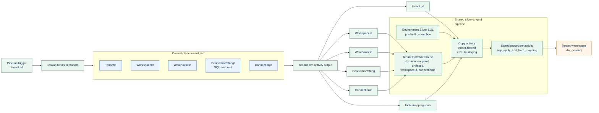
```mermaid
flowchart LR
    Trigger["Pipeline trigger<br/>tenant_id"] --> Lookup["Lookup tenant metadata"]

    subgraph Metadata["Control-plane tenant_info"]
        TenantId["TenantId"]
        WorkspaceId["WorkspaceId"]
        WarehouseId["WarehouseId"]
        SqlEndpoint["ConnectionString/ <br/>SQL endpoint"]
        ConnectionId["ConnectionId"]
    end

    Lookup --> Metadata
    Metadata --> TenantInfo["Tenant Info activity output"]

    TenantInfo --> P1["tenant_id"]
    TenantInfo --> P2["WorkspaceId"]
    TenantInfo --> P3["WarehouseId"]
    TenantInfo --> P4["ConnectionString"]
    TenantInfo --> P5["ConnectionId"]
    TenantInfo --> P6["table mapping rows"]

    subgraph SharedPipe["Shared silver-to-gold<br/>pipeline"]
        SilverSourceConn["Environment Silver SQL<br/>pre-built connection"]
        Copy["Copy activity<br/>tenant-filtered<br/>silver to staging"]
        Conn["Tenant DataWarehouse<br/>dynamic endpoint, artifactId,<br/>workspaceId, connectionId"]
        SP["Stored procedure activity<br/>usp_apply_scd_from_mapping"]
    end

    SilverSourceConn --> Copy
    P1 --> Copy
    P6 --> Copy
    P2 --> Conn
    P3 --> Conn
    P4 --> Conn
    P5 --> Conn
    Conn --> Copy
    Copy --> SP

    SP --> Target["Tenant warehouse<br/>dw_{tenant}"]

    classDef metadata fill:#e8f3ff,stroke:#2f70b7,color:#102a43
    classDef runtime fill:#eaf7ef,stroke:#2f855a,color:#102a43
    classDef tenant fill:#fff4e6,stroke:#b7791f,color:#102a43

    class TenantId,WorkspaceId,WarehouseId,SqlEndpoint,ConnectionId metadata
    class Trigger,Lookup,TenantInfo,P1,P2,P3,P4,P5,P6,SilverSourceConn,Copy,Conn,SP runtime
    class Target tenant
```

```json
{
  "parameters": {
    "ingestion_date": { "type": "string" },
    "tenant_id": { "type": "string" },
    "Environment": { "type": "string" },
    "LakehouseId": { "type": "string" },
    "core_workspaceid": { "type": "string" },
    "processing_workspaceid": { "type": "string" },
    "notebook_id": { "type": "string" },
    "dq_notebook_id": { "type": "string" },
    "silver_connectionid": { "type": "string" },
    "silver_wh_endpoint_id": { "type": "string" },
    "silver_sqlconnectionstring": { "type": "string" }
  }
}
```

These parameters remove environment-specific Fabric item IDs from the activity definitions. For example, the Bronze-to-Silver and DQ notebooks receive the notebook ID and processing workspace ID at runtime, while the metadata lookups use the core workspace ID and core lakehouse ID.

The pipeline first filters the control-plane tenant registry to the requested tenant:

```json
{
  "name": "Tenant Info",
  "type": "Filter",
  "typeProperties": {
    "items": {
      "value": "@activity('Tenant Info Table').output.value",
      "type": "Expression"
    },
    "condition": {
      "value": "@equals(item().TenantId, pipeline().parameters.tenant_id)",
      "type": "Expression"
    }
  }
}
```

The same parameterized approach is used for Fabric items owned by the processing and control-plane workspaces:

```json
{
  "type": "Lakehouse",
  "typeProperties": {
    "workspaceId": "@pipeline().parameters.core_workspaceid",
    "artifactId": "@pipeline().parameters.LakehouseId",
    "rootFolder": "Tables"
  }
}
```

For tenant warehouse operations, the resolved tenant values are then bound into the warehouse connection at runtime:

```json
{
  "type": "DataWarehouse",
  "typeProperties": {
    "artifactId": "@activity('Tenant Info').output.value[0].WarehouseId",
    "endpoint": "@activity('Tenant Info').output.value[0].ConnectionString",
    "workspaceId": "@activity('Tenant Info').output.value[0].WorkspaceId"
  },
  "externalReferences": {
    "connection": "@activity('Tenant Info').output.value[0].ConnectionId"
  }
}
```

This is the key mechanism that allows a shared processing pipeline to load different tenant warehouses without cloning the pipeline per tenant.

The Copy activity that reads Silver data and writes it to Gold staging has one special requirement: the source side reads from the Silver SQL endpoint and requires an explicit connection ID. The final pipeline makes that requirement dynamic by parameterizing the source connection ID, SQL endpoint item ID, and SQL endpoint string:

```json
{
  "type": "DataWarehouse",
  "typeProperties": {
    "endpoint": "@pipeline().parameters.silver_sqlconnectionstring",
    "artifactId": "@pipeline().parameters.silver_wh_endpoint_id",
    "workspaceId": "@pipeline().parameters.processing_workspaceid"
  },
  "externalReferences": {
    "connection": "@pipeline().parameters.silver_connectionid"
  }
}
```

By parameterizing the silver connection, the pipeline does not need the Silver source connection hardcoded into the activity definition. The caller supplies the correct values for the environment. For example, a DEV run can pass the DEV Silver connection values, a TEST run can pass the TEST values, and a PROD run can pass the PROD values.

The Gold sink Warehouse connection is different. It can be a single reusable Warehouse connection when the same authenticated identity has access to the DEV, TEST, and PROD tenant warehouses. In that case, `WorkspaceId`, `WarehouseId`, and `ConnectionString` choose the target at runtime, while the Warehouse connection supplies the credential context. Separate Gold sink Warehouse connections are only needed when each environment uses a different identity, tenant, credential policy, or connection ownership model.

A simplified source query shows the same runtime binding idea applied to tenant filtering:

```json
{
  "sqlReaderQuery": {
    "value": "@concat('SELECT * FROM sales.', item().silver_table, ' WHERE tenant_id = ''', pipeline().parameters.tenant_id, '''')",
    "type": "Expression"
  }
}
```

In a production hardening pass, the source schema and table naming should also be metadata-driven and validated against allowed mappings. The pattern remains the same. Bind the tenant context at runtime, not at design time.

## Metadata-Driven ELT

The ELT flow follows Bronze -> Silver -> Gold.

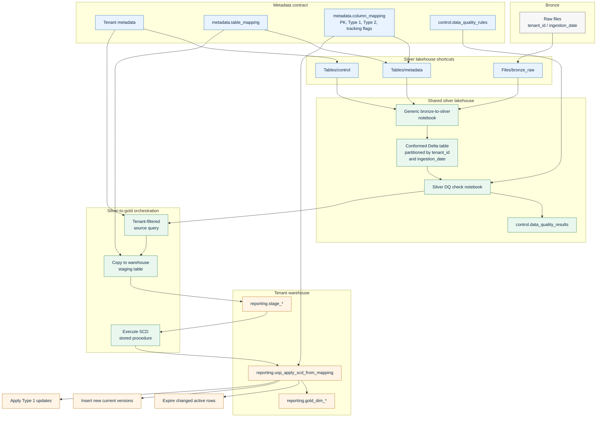
```mermaid
flowchart TB
    subgraph Bronze["Bronze"]
        Raw["Raw files<br/>tenant_id / ingestion_date"]
    end

    subgraph Shortcuts["Silver lakehouse shortcuts"]
        BronzeRawShortcut["Files/bronze_raw"]
        ControlShortcut["Tables/control"]
        MetadataShortcut["Tables/metadata"]
    end

    subgraph Silver["Shared silver lakehouse"]
        GenericSilver["Generic bronze-to-silver<br/>notebook"]
        SilverTable["Conformed Delta table<br/>partitioned by tenant_id<br/>and ingestion_date"]
        DQCheck["Silver DQ check notebook"]
        DQResults["control.data_quality_results"]
    end

    subgraph Metadata["Metadata contract"]
        TenantMeta["Tenant metadata"]
        TableMap["metadata.table_mapping"]
        ColumnMap["metadata.column_mapping<br/>PK, Type 1, Type 2, tracking flags"]
        DQRules["control.data_quality_rules"]
    end

    subgraph Pipeline["Silver-to-gold orchestration"]
        TenantFilter["Tenant-filtered<br/>source query"]
        StageLoad["Copy to warehouse<br/>staging table"]
        ExecuteSCD["Execute SCD<br/>stored procedure"]
    end

    subgraph Warehouse["Tenant warehouse"]
        Stage["reporting.stage_*"]
        SCDProc["reporting.usp_apply_scd_from_mapping"]
        Dim["reporting.gold_dim_*"]
    end

    Raw --> BronzeRawShortcut
    TenantMeta --> ControlShortcut
    TableMap --> MetadataShortcut
    ColumnMap --> MetadataShortcut

    BronzeRawShortcut --> GenericSilver
    ControlShortcut --> GenericSilver
    MetadataShortcut --> GenericSilver

    GenericSilver --> SilverTable
    SilverTable --> DQCheck
    DQRules --> DQCheck
    DQCheck --> DQResults
    DQCheck --> TenantFilter

    TenantMeta --> TenantFilter
    TableMap --> StageLoad
    ColumnMap --> SCDProc

    TenantFilter --> StageLoad
    StageLoad --> Stage
    Stage --> ExecuteSCD
    ExecuteSCD --> SCDProc
    SCDProc --> Dim

    SCDProc --> Expire["Expire changed active rows"]
    SCDProc --> Insert["Insert new current versions"]
    SCDProc --> Type1["Apply Type 1 updates"]

    classDef bronze fill:#f7f7f7,stroke:#666,color:#102a43
    classDef shortcut fill:#e8f3ff,stroke:#2f70b7,color:#102a43
    classDef silver fill:#eaf7ef,stroke:#2f855a,color:#102a43
    classDef metadata fill:#e8f3ff,stroke:#2f70b7,color:#102a43
    classDef warehouse fill:#fff4e6,stroke:#b7791f,color:#102a43

    class Raw bronze
    class BronzeRawShortcut,ControlShortcut,MetadataShortcut shortcut
    class GenericSilver,SilverTable,DQCheck,DQResults,TenantFilter,StageLoad,ExecuteSCD silver
    class TenantMeta,TableMap,ColumnMap,DQRules metadata
    class Stage,SCDProc,Dim,Expire,Insert,Type1 warehouse
```

### Bronze

Bronze stores raw source files with tenant and ingestion-date context. The goal is recoverability and replay, not conformance.

### Silver

Silver applies shared conformance logic and preserves tenant context. A generic notebook pattern reads tenant, source table, target table, run ID, warehouse ID, and ingestion-date parameters, enriches the data with audit columns, removes duplicates, writes partitioned Delta tables, and emits structured operational logs. In the final pipeline, the notebook ID, DQ notebook ID, processing workspace ID, core workspace ID, and core lakehouse ID are passed as parameters so the same orchestration can be promoted across environments.

### Generic Bronze-to-Silver Notebook Pattern

The Bronze-to-Silver flow is generic because the pipeline reads entity configuration from metadata and invokes the same notebook for each active mapping. In the final Sales pipeline, the `Table Mapping` lookup reads the `metadata.table_mapping` Lakehouse table through the parameterized core lakehouse binding:

```json
{
  "name": "Table Mapping",
  "type": "Lookup",
  "dependsOn": [
    {
      "activity": "Tenant Info",
      "dependencyConditions": [
        "Succeeded"
      ]
    }
  ],
  "typeProperties": {
    "source": {
      "type": "LakehouseTableSource"
    },
    "firstRowOnly": false,
    "datasetSettings": {
      "linkedService": {
        "type": "Lakehouse",
        "typeProperties": {
          "workspaceId": "@pipeline().parameters.core_workspaceid",
          "artifactId": "@pipeline().parameters.LakehouseId",
          "rootFolder": "Tables"
        }
      },
      "type": "LakehouseTable",
      "typeProperties": {
        "schema": "metadata",
        "table": "table_mapping"
      }
    }
  }
}
```

Use the declared pipeline parameter name consistently. In this implementation the parameter is `LakehouseId`, and the Lakehouse lookup activities should reference the same casing when binding the core lakehouse artifact.

The pipeline then iterates over the metadata rows and passes each row into the same notebook as parameters:

```json
{
  "type": "ForEach",
  "typeProperties": {
    "batchCount": 2,
    "items": {
      "value": "@activity('Table Mapping').output.value",
      "type": "Expression"
    },
    "activities": [
      {
        "name": "bronze_to_silver",
        "type": "TridentNotebook",
        "typeProperties": {
          "parameters": {
            "tenant_id": {
              "value": { "value": "@pipeline().parameters.tenant_id", "type": "Expression" },
              "type": "string"
            },
            "source_table": {
              "value": { "value": "@item().source_table", "type": "Expression" },
              "type": "string"
            },
            "target_table": {
              "value": { "value": "@item().silver_table", "type": "Expression" },
              "type": "string"
            },
            "ingestion_date": {
              "value": { "value": "@pipeline().parameters.ingestion_date", "type": "Expression" },
              "type": "string"
            },
            "run_id": {
              "value": { "value": "@pipeline().RunId", "type": "Expression" },
              "type": "string"
            },
            "warehouse_id": {
              "value": { "value": "@activity('Tenant Info').output.value[0].WarehouseId", "type": "Expression" },
              "type": "string"
            }
          }
        }
      }
    ]
  }
}
```

Inside the notebook, those parameters drive the bronze file path, audit columns, target silver table, and partition overwrite. The notebook is therefore generic across tenants and datasets:

```python
tenant_id = "tenant1"
source_table = "bronze_orders"
target_table = "silver_orders"
ingestion_date_param = "20260506"
run_id = "test"
warehouse_id = "test"
Environment = "DEV"

if ingestion_date_param:
    ingestion_date_col = to_date(lit(ingestion_date_param), "yyyyMMdd")
    ingestion_date_str = f"{ingestion_date_param[:4]}-{ingestion_date_param[4:6]}-{ingestion_date_param[6:8]}"
else:
    ingestion_date_col = current_date()
    ingestion_date_str = spark.sql("SELECT current_date()").collect()[0][0].strftime("%Y-%m-%d")

file_name = f"{source_table}.csv"
source_path = f"Files/sales/tenant_id={tenant_id}/ingestion_date={ingestion_date_param}/{file_name}"
silver_table = f"sales.{target_table}"
```

The same notebook applies standard Silver enrichment and data hygiene:

```python
df = (
    spark.read.format("csv")
    .option("header", "true")
    .option("inferSchema", "true")
    .load(source_path)
)

df = (
    df
    .withColumn("tenant_id", lit(tenant_id))
    .withColumn("ingestion_timestamp", current_timestamp())
    .withColumn("ingestion_date", ingestion_date_col)
    .dropDuplicates()
)
```

The notebook also resolves the logging endpoint from `control.config`, so logging remains environment-aware:

```python
def get_log_function_url():
    row = (
        spark.table("control.config")
        .filter(
            (col("config_key") == "LOG_FUNCTION_URL") &
            (col("Environment") == Environment)
        )
        .select("config_value")
        .limit(1)
        .first()
    )

    if row is None or not row[0]:
        raise ValueError("LOG_FUNCTION_URL not found in control.config")

    return row[0]
```

On success or failure, the notebook emits the same operational envelope used elsewhere in the platform:

```python
log_details = f"warehouse_id: {warehouse_id}, source: {source_table}, target: {target_table}"
log_event(
    status="SUCCESS",
    message="Loaded tables successfully",
    details=log_details,
    duration_seconds=duration_seconds
)
```

The relevant architectural behavior is the partition overwrite:

```python
replace_where = f"""
tenant_id = '{tenant_id}'
AND ingestion_date = DATE '{ingestion_date_str}'
"""

df.write \
    .format("delta") \
    .mode("overwrite") \
    .partitionBy("tenant_id", "ingestion_date") \
    .option("replaceWhere", replace_where) \
    .option("mergeSchema", "true") \
    .saveAsTable(silver_table)
```

This supports reruns for a specific tenant and ingestion date without rewriting unrelated data.

### Data Quality Check Pattern

Data quality is part of the processing path, not an offline reporting exercise. In the final processing pipeline, the `Silver DQ Check` notebook runs after Bronze-to-Silver completes and before Silver-to-Gold staging begins. That placement allows the platform to validate tenant-filtered Silver data before it is copied into the tenant warehouse serving layer.

The DQ framework is metadata-driven. Rules are stored in `control.data_quality_rules`, and execution results are appended to `control.data_quality_results`. The results table follows the same control-plane pattern even though it is produced operationally rather than configured upfront.

The results table captures the DQ outcome at run, tenant, entity, and rule granularity:

| Column | Description |
| --- | --- |
| `runId` | Fabric pipeline or notebook run identifier |
| `tenantId` | Tenant evaluated by the DQ check |
| `entity_name` | Entity or Silver table evaluated |
| `rule_type` | Rule type that was executed |
| `column_name` | Column evaluated by the rule, when applicable |
| `failed_count` | Number of records that failed the rule |
| `status` | Rule execution result, such as passed or failed |
| `severity` | Severity copied from the rule definition |
| `event_time` | Timestamp when the result was recorded |

```python
tenantId = "tenant7"
runId = "test"

rules_df = spark.table("control.data_quality_rules")
entities = [
    row["entity_name"]
    for row in rules_df.select("entity_name").distinct().collect()
]
```

For each active entity rule, the notebook resolves the Silver table, filters to the current tenant, and evaluates the rule. The implemented checks cover common table-level and column-level controls:

```python
for entity_name in entities:
    rules = (
        spark.table("control.data_quality_rules")
        .filter(col("entity_name") == entity_name)
        .filter(col("is_active") == True)
        .collect()
    )

    entity_name = "sales." + entity_name
    df_entity = spark.table(entity_name).filter(col("tenant_id") == tenantId)

    for rule in rules:
        rule_type = rule["rule_type"]
        column_name = rule["column_name"]
        rule_value = rule["rule_value"]

        if rule_type == "NOT_NULL":
            failed_count = df_entity.filter(col(column_name).isNull()).count()

        elif rule_type == "UNIQUE":
            failed_count = (
                df_entity
                .groupBy(column_name)
                .count()
                .filter(col("count") > 1)
                .count()
            )

        elif rule_type == "ALLOWED_VALUES":
            allowed = [x.strip() for x in rule_value.split(",")]
            failed_count = df_entity.filter(~col(column_name).isin(allowed)).count()
```

The result set keeps the run ID, tenant ID, entity, rule type, column, failure count, status, severity, and event time. This gives the control plane a queryable DQ history by tenant and run:

```python
status = "PASSED" if failed_count == 0 else "FAILED"

results.append((
    runId,
    tenantId,
    entity_name,
    rule_type,
    column_name,
    failed_count,
    status,
    severity,
    datetime.utcnow()
))

df_results = spark.createDataFrame(results, [
    "runId",
    "tenantId",
    "entity_name",
    "rule_type",
    "column_name",
    "failed_count",
    "status",
    "severity",
    "event_time"
])

df_results.write.format("delta").mode("append").saveAsTable("control.data_quality_results")
```

Architecturally, the DQ framework has two important properties:

- Rules are configured centrally and evaluated generically.
- Results are stored in the control plane, where they can support operational dashboards, deployment gates, tenant SLA reporting, and incident analysis.

### Gold

Gold is loaded into tenant-specific Fabric warehouses after the Silver DQ check succeeds. The pipeline first stages tenant-filtered silver data into the warehouse, then executes a warehouse stored procedure to apply dimensional merge and SCD behavior.

In the final processing pipeline, the target warehouse side is dynamically bound from `control.tenant_info`. The Copy activity sink, staging cleanup script, and SCD procedure use the tenant's resolved `WorkspaceId`, `WarehouseId`, `ConnectionString`, and, where required by the activity, `ConnectionId`. The source side of the Silver-to-Gold Copy activity is also dynamic now: the pipeline receives `silver_connectionid`, `silver_wh_endpoint_id`, and `silver_sqlconnectionstring` as runtime parameters.

The staging table is an intentional handoff boundary between Fabric orchestration and warehouse processing. Bronze-to-Silver can run cleanly in a notebook because both sides are lakehouse assets. Silver-to-Gold is has a different setup. Tenant data is in the shared Silver lakehouse, while the dimensional serving model belongs in a tenant Fabric Warehouse, often in a different workspace. A Fabric notebook running in the Silver lakehouse is not the right mechanism for writing directly into tenant warehouse dimensional tables across that boundary.

The Copy activity performs the cross-workspace, tenant-filtered bulk load from shared Silver into a tenant-local staging table. It does not write directly into dimensional Gold tables. The warehouse stored procedure then owns the relational merge, SCD Type 1 and Type 2 behavior, active flags, validity windows, and change tracking. This makes failures easier to diagnose, allows the SCD step to be retried without rereading Silver, and keeps dimensional table updates under warehouse-controlled SQL logic.

The Gold layer uses Fabric Warehouse in this pattern as it fits the additional requirements. It is expected to support SQL-first reporting, dimensional models, SCD behavior, stable schemas, database project deployment, and tenant-level operational boundaries. The Lakehouse remains the better choice when the serving layer is still lake-native, exploratory, Spark-heavy, ML-oriented, semi-structured, or designed around open Delta tables rather than relational warehouse contracts.

## Warehouse Metadata Contract

The control-plane source of truth for table and column mapping is `metadata.table_mapping` and `metadata.column_mapping`. During tenant setup and warehouse schema deployment, the relevant mapping metadata is made available in the tenant warehouse reporting schema as `reporting.table_mapping` and `reporting.column_mapping`.

The copy is deliberate. The core lakehouse remains the metadata system of record, but the SCD procedure executes inside the tenant warehouse. Because the warehouse procedure cannot reliably perform cross-workspace queries back to the core lakehouse during execution, the mapping metadata must be copied into the tenant warehouse. Keeping a warehouse-local copy of the mapping tables lets the procedure resolve source columns, target columns, business keys, and SCD flags inside the same warehouse where the merge runs.

This is more resilient than dynamically creating shortcuts from each tenant warehouse back to the core lakehouse. Shortcuts would make the merge depend on cross-workspace resolution, shortcut availability, and permissions to another workspace at runtime. Local mapping tables keep the SCD execution self-contained inside the tenant warehouse. The tradeoff is that mapping synchronization must be managed, but in this architecture that synchronization is already part of the controlled tenant setup and all-tenant database rollout lifecycle. It also binds the mapping version to the tenant warehouse deployment, which makes provisioning, rollback, and rollout behavior easier to reason about.

The tenant warehouse copy of the column mapping table carries the behavioral metadata needed by the SCD stored procedure:

```sql
CREATE TABLE [reporting].[column_mapping] (
    [column_map_id]        VARCHAR (8000) NULL,
    [table_map_id]         VARCHAR (8000) NULL,
    [source_table]         VARCHAR (8000) NULL,
    [source_column]        VARCHAR (8000) NULL,
    [target_column]        VARCHAR (8000) NULL,
    [target_table]         VARCHAR (8000) NULL,
    [transformation_logic] VARCHAR (8000) NULL,
    [is_scd_type1]         BIT            NULL,
    [is_scd_type2]         BIT            NULL,
    [track_changes]        BIT            NULL,
    [is_primary_key]       BIT            NULL,
    [is_nullable]          BIT            NULL,
    [is_active]            BIT            NULL
);
```

This table is not just documentation. It is executable metadata. The warehouse stored procedure reads it to determine primary keys, Type 1 columns, Type 2 columns, and change tracking behavior.

## Dynamic SCD Procedure Pattern

The warehouse procedure `reporting.usp_apply_scd_from_mapping` builds the required merge behavior from the mapping table.

The core pattern is:

```sql
SELECT
    @PKJoin =
        STRING_AGG(
            CASE
                WHEN is_primary_key = 1 THEN
                    N's.' + QUOTENAME(source_column) +
                    N' = t.' + QUOTENAME(target_column)
            END,
            N' AND '
        ),
    @Type1Set =
        STRING_AGG(
            CASE
                WHEN is_scd_type1 = 1 THEN
                    N't.' + QUOTENAME(target_column) +
                    N' = s.' + QUOTENAME(source_column)
            END,
            N', '
        ),
    @Type2Diff =
        STRING_AGG(
            CASE
                WHEN is_scd_type2 = 1
                 AND track_changes = 1 THEN
                    N'ISNULL(CONVERT(nvarchar(max),s.' +
                    QUOTENAME(source_column) +
                    N'),''<NULL>'') <> ' +
                    N'ISNULL(CONVERT(nvarchar(max),t.' +
                    QUOTENAME(target_column) +
                    N'),''<NULL>'')'
            END,
            N' OR '
        )
FROM reporting.column_mapping
WHERE target_table = @TargetTable;
```

The generated SQL then applies the dimensional behavior transactionally:

```sql
BEGIN TRY
    BEGIN TRAN;

    IF OBJECT_ID('tempdb..#chg') IS NOT NULL
        DROP TABLE #chg;

    -- Identify new or changed rows.
    SELECT s.*, IIF(t.<metadata-primary-key> IS NULL, 'New', 'Changed') AS Change_Type
    INTO #chg
    FROM <source-table> s
    LEFT JOIN <active-target-dimension> t
        ON <metadata-built primary-key join>
    WHERE t.<metadata-primary-key> IS NULL
       OR (<metadata-built type-2 comparison>);

    -- Expire active Type 2 rows.
    UPDATE t
       SET t.is_active = 0,
           t.valid_to = GETUTCDATE()
    FROM <target-dimension> t
    JOIN #chg c
      ON <metadata-built primary-key join>
    WHERE t.is_active = 1;

    -- Insert new current versions.
    INSERT INTO <target-dimension> (...)
    SELECT ...
    FROM #chg;

    COMMIT TRAN;
END TRY
BEGIN CATCH
    IF @@TRANCOUNT > 0
        ROLLBACK TRAN;
    THROW;
END CATCH;
```

This is a good example of using dynamic SQL for the right reason. The dynamic part is not business logic hidden in strings. The dynamic part is the metadata-defined shape of the merge.

## Observability as a Platform Service

Operational logging is treated as a shared service, not as an afterthought inside each notebook.

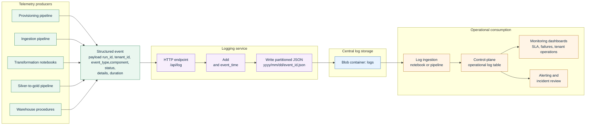
```mermaid
flowchart LR
    subgraph Producers["Telemetry producers"]
        Prov["Provisioning pipeline"]
        Ingest["Ingestion pipeline"]
        Transform["Transformation notebooks"]
        GoldLoad["Silver-to-gold pipeline"]
        Warehouse["Warehouse procedures"]
    end

    Event["Structured event<br/>payload run_id, tenant_id, <br/> event_type,component, status,<br/>details, duration"]

    subgraph Service["Logging service"]
        Http["HTTP endpoint<br/>/api/log"]
        Enrich["Add <br/>and event_time"]
        Partition["Write partitioned JSON<br/>yyyy/mm/dd/event_id.json"]
    end

    subgraph Store["Central log storage"]
        Blob["Blob container: logs"]
    end

    subgraph Consumption["Operational consumption"]
        IngestLogs["Log ingestion<br/>notebook or pipeline"]
        ControlLogs["Control-plane<br/>operational log table"]
        Dashboards["Monitoring dashboards<br/>SLA, failures, tenant operations"]
        Alerts["Alerting and<br/>incident review"]
    end

    Prov --> Event
    Ingest --> Event
    Transform --> Event
    GoldLoad --> Event
    Warehouse --> Event

    Event --> Http
    Http --> Enrich
    Enrich --> Partition
    Partition --> Blob

    Blob --> IngestLogs
    IngestLogs --> ControlLogs
    ControlLogs --> Dashboards
    ControlLogs --> Alerts

    classDef producers fill:#eaf7ef,stroke:#2f855a,color:#102a43
    classDef service fill:#f7eefc,stroke:#805ad5,color:#102a43
    classDef store fill:#e8f3ff,stroke:#2f70b7,color:#102a43
    classDef consume fill:#fff4e6,stroke:#b7791f,color:#102a43

    class Prov,Ingest,Transform,GoldLoad,Warehouse,Event producers
    class Http,Enrich,Partition service
    class Blob store
    class IngestLogs,ControlLogs,Dashboards,Alerts consume
```

Fabric pipelines emit structured telemetry through Web Activities. A typical event payload looks like this:

```json
{
  "run_id": "@{pipeline().RunId}",
  "tenant_id": "@{pipeline().parameters.tenantid}",
  "event_type": "WAREHOUSE_CREATED",
  "component": "provisioning",
  "details": "Warehouse_id: @{variables('warehouseId')}, WarehouseName: dw_@{pipeline().parameters.tenantid}",
  "status": "SUCCESS",
  "message": "Warehouse created successfully",
  "duration_seconds": 0
}
```

The logging service is intentionally small. It accepts the event, enriches it with an event ID and event time, and writes partitioned JSON logs to Blob Storage.

```python
import azure.functions as func
import datetime
import json
import os
import uuid

from azure.storage.blob import BlobServiceClient

app = func.FunctionApp()

CONNECTION_STRING = os.getenv("AzureWebJobsStorage")
CONTAINER_NAME = "logs"


def get_container():
    blob_service = BlobServiceClient.from_connection_string(CONNECTION_STRING)
    return blob_service.get_container_client(CONTAINER_NAME)


@app.route(route="log", methods=["POST"], auth_level=func.AuthLevel.FUNCTION)
def log_event(req: func.HttpRequest) -> func.HttpResponse:
    body = req.get_json()
    now = datetime.datetime.utcnow()

    log_record = {
        "event_id": str(uuid.uuid4()),
        "run_id": body.get("run_id"),
        "tenant_id": body.get("tenant_id"),
        "event_type": body.get("event_type"),
        "component": body.get("component"),
        "details": body.get("details"),
        "status": body.get("status"),
        "message": body.get("message"),
        "duration_seconds": body.get("duration_seconds"),
        "event_time": now.isoformat()
    }

    blob_name = f"{now.strftime('%Y/%m/%d')}/{log_record['event_id']}.json"
    get_container().get_blob_client(blob_name).upload_blob(
        json.dumps(log_record),
        overwrite=False
    )

    return func.HttpResponse(
        json.dumps({"status": "logged"}),
        mimetype="application/json",
        status_code=200
    )
```

This creates a durable operational event stream that can later be ingested into the control plane for monitoring dashboards, SLA reporting, failure analysis, and tenant-level operational visibility.

The important architectural decision is decoupling logging from the orchestration engine. Fabric pipelines emit events. Rhe logging service owns persistence and the control plane can consume the logs later.

## CI/CD and Schema Lifecycle

Warehouse schema deployment is separated from runtime orchestration.

The warehouse project contains source-controlled definitions for:

- Security scripts
- Reporting tables
- Mapping tables
- Stored procedures
- Azure DevOps deployment pipelines

Provisioning creates or discovers Fabric infrastructure. CI/CD deploys the database shape. Pipelines move and process data. Keeping those responsibilities separate improves release control and reduces the risk of runtime orchestration becoming a schema deployment tool.

### Fabric Deployment Pipeline for Environment Promotion

For this project, I only created a deployment pipeline for the control plane. The same pattern can be used for the processing plane.

Fabric artifacts are promoted through a Fabric Deployment Pipeline with three stages:

- Development: `dev-ws-control-plane`
- Test: `test-ws-control-plane`
- Production: `prod-ws-control-plane`


This gives the platform an environment promotion path for Fabric artifacts that is separate from tenant warehouse database deployment. Fabric Deployment Pipelines promote Fabric items across workspaces, while the warehouse `DACPAC` pipeline deploys tenant database schema to a specific tenant warehouse.

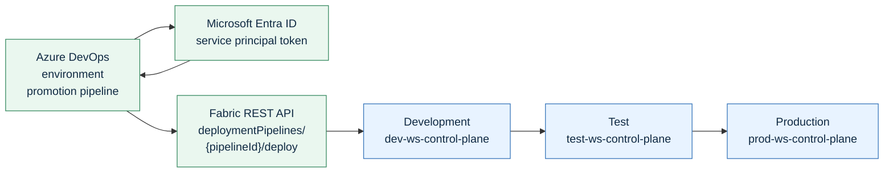
```mermaid
flowchart LR
    Dev["Development<br/>dev-ws-control-plane"]
    Test["Test<br/>test-ws-control-plane"]
    Prod["Production<br/>prod-ws-control-plane"]

    DevOps["Azure DevOps<br/>environment<br/>promotion pipeline"]
    Entra["Microsoft Entra ID<br/>service principal token"]
    FabricAPI["Fabric REST API<br/>deploymentPipelines/<br/>{pipelineId}/deploy"]

    DevOps --> Entra
    Entra --> DevOps
    DevOps --> FabricAPI
    FabricAPI --> Dev
    Dev --> Test
    Test --> Prod

    classDef env fill:#e8f3ff,stroke:#2f70b7,color:#102a43
    classDef automation fill:#eaf7ef,stroke:#2f855a,color:#102a43

    class Dev,Test,Prod env
    class DevOps,Entra,FabricAPI automation
```

The Azure DevOps promotion pipeline uses the same automation identity model described earlier. It retrieves an access token, then calls the Fabric Deployment Pipeline API. The final YAML uses a single `sourceEnvironment` parameter and resolves the source and target Fabric stage IDs from the `fabric-cicd-vars` variable group.

```yaml
trigger: none

parameters:
- name: sourceEnvironment
  displayName: Promote from environment
  type: string
  default: DEV
  values:
  - DEV
  - TEST

variables:
- group: fabric-cicd-vars

stages:
- stage: Promote_Fabric
  displayName: "Deploy Fabric from ${{ parameters.sourceEnvironment }}"
```

The variable group contains the stage IDs:

```text
DevStageID
TestStageID
ProdStageID
```

The Fabric UI does not expose these stage IDs directly. To populate the Azure DevOps variable group, call the Fabric Deployment Pipeline stages API and copy the returned `id` values for the Development, Test, and Production stages:

```http
GET https://api.fabric.microsoft.com/v1/deploymentPipelines/{pipeline-id}/stages
```

The response contains one object per stage:

```json
{
    "value": [
        {
            "id": "b7e029c1-14....",
            "order": 0,
            "displayName": "Development",
            "description": "",
            "workspaceId": "c2940f4....",
            "workspaceName": "dev-ws-control-plane",
            "isPublic": false
        },
        {
            "id": "1bfe85a5-6....",
            "order": 1,
            "displayName": "Test",
            "description": "",
            "workspaceId": "b8247....",
            "workspaceName": "test-ws-control-plane",
            "isPublic": false
        },
        {
            "id": "ca6c7fa2-d....",
            "order": 2,
            "displayName": "Production",
            "description": "",
            "workspaceId": "0ade96c...",
            "workspaceName": "prod-ws-control-plane",
            "isPublic": true
        }
    ],
    ...
}
```

Copy those values into the variable group as `DevStageID`, `TestStageID`, and `ProdStageID`. This is a one-time setup task unless the Fabric deployment pipeline is recreated.

Also verify that the Azure DevOps service principal has access to the Fabric Deployment Pipeline itself. The principal must be granted deployment pipeline access in Fabric, in addition to workspace permissions on the source and target stages.

For a DEV-to-TEST run, set `sourceEnvironment` to `DEV`. For a TEST-to-PROD run, set `sourceEnvironment` to `TEST`.

The token for Fabric deployment pipeline automation uses the Power BI/Fabric API resource scope:

```powershell
$body = @{
  client_id     = "$(clientId)"
  client_secret = "$(clientSecret)"
  grant_type    = "client_credentials"
  scope         = "https://analysis.windows.net/powerbi/api/.default"
}

$tokenResponse = Invoke-RestMethod `
  -Method Post `
  -Uri "https://login.microsoftonline.com/$(AADtenantId)/oauth2/v2.0/token" `
  -Body $body

$token = $tokenResponse.access_token
```

The pipeline derives source and target stage IDs with a simple branch:

```powershell
$sourceEnvironment = "${{ parameters.sourceEnvironment }}".ToUpperInvariant()

if ($sourceEnvironment -eq "DEV") {
  $targetEnvironment = "TEST"
  $sourceStageId = "$(DevStageID)"
  $targetStageId = "$(TestStageID)"
}
elseif ($sourceEnvironment -eq "TEST") {
  $targetEnvironment = "PROD"
  $sourceStageId = "$(TestStageID)"
  $targetStageId = "$(ProdStageID)"
}
else {
  throw "Unsupported sourceEnvironment '$sourceEnvironment'. Use DEV or TEST."
}
```

The deployment request then uses the resolved IDs:

```powershell
$deployBody = @{
  sourceStageId = $sourceStageId
  targetStageId = $targetStageId
} | ConvertTo-Json

$response = Invoke-RestMethod `
  -Method Post `
  -Uri "https://api.fabric.microsoft.com/v1/deploymentPipelines/$(pipelineId)/deploy" `
  -Headers @{
    Authorization = "Bearer $token"
    "Content-Type" = "application/json"
  } `
  -Body $deployBody

$operationId = $response.id
```

This pattern makes environment promotion repeatable and auditable. The Fabric deployment pipeline records deployment history, while Azure DevOps provides source control integration, controlled triggers, variable governance, and release logs.

### Database Deployment Token Acquisition

The tenant database deployment pipeline builds the SQL project into a `DACPAC`, downloads the artifact in the provisioning stage, and deploys it to the tenant Fabric Warehouse with `SqlPackage`. Because the deployment runs non-interactively from Azure DevOps, the pipeline obtains an Azure AD access token using the service principal stored in the `fabric-cicd-vars` variable group.

The pipeline is parameterized by the Fabric tenant provisioning pipeline:

```yaml
parameters:
- name: tenantId
  type: string

- name: sqlServer
  type: string

variables:
- group: fabric-cicd-vars
```

The deployment stage derives the target database name from the tenant and receives the Fabric Warehouse SQL endpoint from the provisioning pipeline:

```powershell
$tenantId = "${{ parameters.tenantId }}"
$sqlhost  = "${{ parameters.sqlServer }}"
$database = "dw_$tenantId"
$dacpacPath = "$(Pipeline.Workspace)/dacpac/fabric-tenant-dw.dacpac"

if (!(Test-Path $dacpacPath)) {
    throw "DACPAC not found at $dacpacPath"
}
```

The important part is token acquisition. The token scope is `https://database.windows.net/.default` because `SqlPackage` is connecting to the Fabric Warehouse SQL endpoint through the SQL access path:

```powershell
$body = @{
    client_id     = "$(clientId)"
    client_secret = "$(clientSecret)"
    scope         = "https://database.windows.net/.default"
    grant_type    = "client_credentials"
}

$tokenResponse = Invoke-RestMethod `
    -Method Post `
    -Uri "https://login.microsoftonline.com/$(aadTenantId)/oauth2/v2.0/token" `
    -Body $body `
    -ContentType "application/x-www-form-urlencoded"

$accessToken = $tokenResponse.access_token

if (-not $accessToken) {
    throw "Failed to acquire Azure AD access token"
}
```

The DACPAC deployment then passes the token directly to `SqlPackage`:

```powershell
SqlPackage `
  /Action:Publish `
  /SourceFile:$dacpacPath `
  /TargetServerName:$sqlhost `
  /TargetDatabaseName:$database `
  /AccessToken:$accessToken
```

This keeps the warehouse deployment aligned with the platform identity model. Azure DevOps does not need an interactive database login, and the same service principal permission model used by the platform can be audited and rotated centrally.

### All-Tenant Database Change Rollout

Tenant provisioning handles the first deployment for a new tenant. The final implementation also includes a separate Azure DevOps pipeline, `azure-pipelines-all-tenants.yml`, for applying database changes to every active tenant warehouse.

The database deployment handles two cases:

- Tenant provisioning: create or resolve one tenant's Fabric workspace and warehouse, deploy the database, and register the tenant after success.
- All-tenant rollout: build the latest DACPAC once, discover all active tenants from the control-plane registry, and deploy the change across every active tenant warehouse.

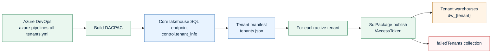
```mermaid
flowchart LR
    DevOps["Azure DevOps<br/>azure-pipelines-all-tenants.yml"]
    Build["Build DACPAC"]
    Registry["Core lakehouse SQL endpoint<br/>control.tenant_info"]
    Manifest["Tenant manifest<br/>tenants.json"]
    Loop["For each active tenant"]
    Deploy["SqlPackage publish<br/>/AccessToken"]
    TenantDW["Tenant warehouses<br/>dw_{tenant}"]
    Failures["failedTenants collection"]

    DevOps --> Build
    Build --> Registry
    Registry --> Manifest
    Manifest --> Loop
    Loop --> Deploy
    Deploy --> TenantDW
    Deploy --> Failures

    classDef cicd fill:#eaf7ef,stroke:#2f855a,color:#102a43
    classDef registry fill:#e8f3ff,stroke:#2f70b7,color:#102a43
    classDef tenant fill:#fff4e6,stroke:#b7791f,color:#102a43
    classDef risk fill:#fff5f5,stroke:#c53030,color:#102a43

    class DevOps,Build,Loop,Deploy cicd
    class Registry,Manifest registry
    class TenantDW tenant
    class Failures risk
```

The all-tenant pipeline starts by building and publishing the DACPAC once:

```yaml
trigger: none

parameters:
- name: continueOnTenantFailure
  type: boolean
  default: false

variables:
- group: fabric-cicd-vars

stages:
- stage: Build_DACPAC
  displayName: "Build DACPAC"
```

The second stage discovers active tenants from the control-plane lakehouse SQL endpoint. It authenticates with the same database token scope used for Fabric Warehouse deployment:

```powershell
$body = @{
  client_id     = "$(clientId)"
  client_secret = "$(clientSecret)"
  scope         = "https://database.windows.net/.default"
  grant_type    = "client_credentials"
}

$tokenResponse = Invoke-RestMethod `
  -Method Post `
  -Uri "https://login.microsoftonline.com/$(aadTenantId)/oauth2/v2.0/token" `
  -Body $body `
  -ContentType "application/x-www-form-urlencoded"

$accessToken = $tokenResponse.access_token
```

It then queries `control.tenant_info` for active tenants and writes a tenant manifest:

```powershell
$command.CommandText = @"
SELECT
    TenantId,
    ConnectionString
FROM control.tenant_info
WHERE IsActive = 1
ORDER BY TenantId;
"@

$tenants = @()

while ($reader.Read()) {
  $tenants += @{
    tenantId = [string]$reader["TenantId"]
    sqlServer = [string]$reader["ConnectionString"]
    enabled = $true
  }
}

@{
  tenants = $tenants
} | ConvertTo-Json -Depth 10 | Set-Content -Path $manifestPath -Encoding UTF8
```

The deployment step reads the manifest and publishes the DACPAC to each tenant warehouse:

```powershell
$manifest = Get-Content $tenantsPath -Raw | ConvertFrom-Json
$tenants = @($manifest.tenants | Where-Object { $_.enabled -ne $false })
$failedTenants = @()

foreach ($tenant in $tenants) {
  $tenantId = [string]$tenant.tenantId
  $sqlhost = [string]$tenant.sqlServer
  $database = "dw_$tenantId"

  try {
    SqlPackage `
      /Action:Publish `
      /SourceFile:$dacpacPath `
      /TargetServerName:$sqlhost `
      /TargetDatabaseName:$database `
      /AccessToken:$accessToken

    if ($LASTEXITCODE -ne 0) {
      throw "SqlPackage failed with exit code $LASTEXITCODE"
    }
  }
  catch {
    $failedTenants += $tenantId

    if ("${{ parameters.continueOnTenantFailure }}" -ne "True") {
      throw
    }
  }
}

if ($failedTenants.Count -gt 0) {
  throw "Deployment failed for tenants: $($failedTenants -join ', ')"
}
```

The `continueOnTenantFailure` parameter controls the failure mode:

- `false`: stop immediately on the first tenant deployment failure.
- `true`: attempt all tenants, collect failures, and fail the pipeline at the end if any tenant failed.

New tenant onboarding and existing tenant rollout are now separate but consistent deployment paths, both using the database project, DACPAC artifact, Microsoft Entra service principal, and Azure DevOps release history.

| Concern | Owner |
| --- | --- |
| Workspace and warehouse existence | Fabric provisioning pipeline |
| Tenant metadata registration | Control-plane notebook |
| Fabric artifact promotion | Fabric Deployment Pipeline and Azure DevOps trigger |
| Warehouse schema | Database project and Azure DevOps |
| Existing tenant rollout | `azure-pipelines-all-tenants.yml` |
| ELT movement | Fabric pipelines and notebooks |
| Data quality validation | Metadata-driven Silver DQ notebook |
| SCD processing | Warehouse stored procedure |
| Telemetry | Logging service and control-plane ingestion |

## Operational Hardening Opportunities

The current pattern establishes the core architecture. The next hardening steps would be:

- Validate dynamic table and schema names against metadata allow-lists before execution.
- Standardize error logging for failed pipeline branches, not only success milestones.
- Add retry and poison-message handling around the logging service.
- Ingest log blobs into the control plane for dashboarding and alerting.
- Add DQ thresholds as hard gates before Silver-to-Gold promotion.
- Add tenant-level deployment audit history for all-tenant rollout runs.
- Generate or deploy tenant-specific security policies as part of provisioning.
- Automate semantic model binding after tenant warehouse creation.
- Extend tenant metadata to include environment and domain.

## Generic Analytics Platform Pattern

Although this implementation uses Microsoft Fabric pipelines, notebooks, lakehouses, warehouses, deployment pipelines, and Fabric REST APIs, the architecture pattern is not Fabric-specific. The core ideas can be applied to other analytics platforms. A central control plane, metadata-driven orchestration, shared processing, isolated serving, automated tenant provisioning, environment promotion, operational logging, and governed schema deployment.

The Fabric-specific details matter for implementation, but the architectural principles are portable. Other platforms may use different services for orchestration, storage, compute, CI/CD, identity, and serving, but the same separation of concerns still applies.


## References

- [Fabric REST API identity support](https://learn.microsoft.com/en-us/rest/api/fabric/articles/identity-support)
- [Fabric deployment pipeline automation with APIs](https://learn.microsoft.com/en-us/fabric/cicd/deployment-pipelines/pipeline-automation-fabric)
- [Fabric deployment pipeline permissions](https://learn.microsoft.com/en-us/fabric/cicd/deployment-pipelines/understand-the-deployment-process)
- [Azure DevOps service principals and managed identities](https://learn.microsoft.com/en-us/azure/devops/integrate/get-started/authentication/service-principal-managed-identity?view=azure-devops)
- [Fabric HTTP connection setup](https://learn.microsoft.com/en-us/fabric/data-factory/connector-http)
- [OneLake shortcuts](https://learn.microsoft.com/en-us/fabric/onelake/onelake-shortcuts)
